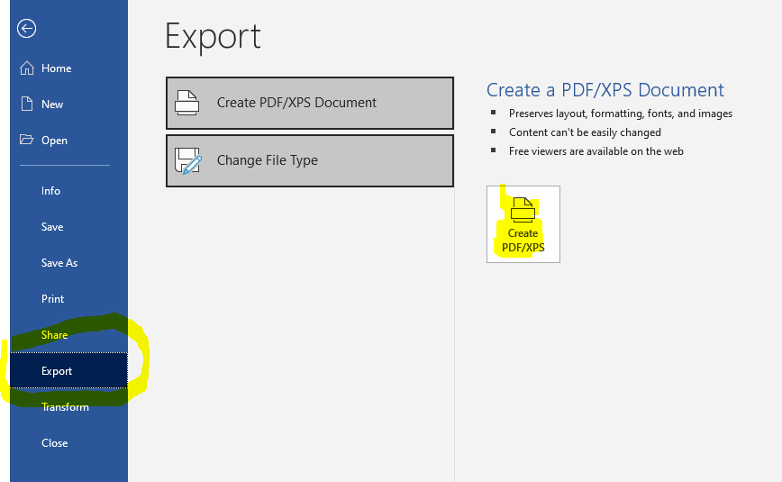
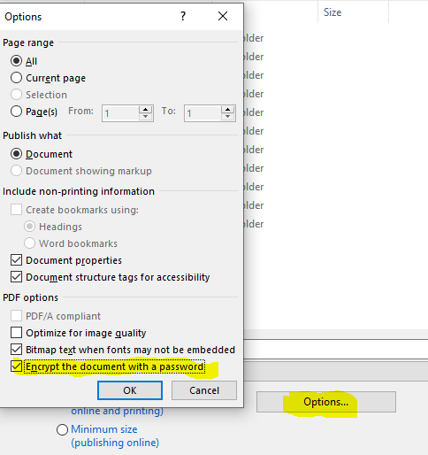

# DFIR Engagement Closeout

## Table of Contents
1. [**Introduction**](#Introduction)
2. [**Closeout Procedure**](#Closeout-Procedure)
	- [Immediate Actions](#Immediate-Actions)
	- [Delayed Actions](#Delayed-Actions)
3. [**Not-Engaged Closeout Procedure**](#Not-Engaged-Closeout-Procedure)
4. [**Tutorials**](#Tutorials)
	- [Creating a Password Protected Final Report](#Creating-a-Password-Protected-Final-Report)

## Introduction
The purpose of this page is to document the closeout procedure for DFIR engagements handled by XFIR. This is is a living document. If there is something you want to see documented here or explained with additional detail please contact your geographic Functional IR Lead (listed on the [Homepage](Home.md)).

## Closeout Procedure
### Immediate Actions
1. Deliver a Final Report:
	1. Generate a password protected PDF of the Final Report:
		- password should be 16 characters long, consisting of mixture of lower and uppercase, numbers and special characters,
		- 	tutorial on how to create password protected PDFs with MS Word is [below](#Creating-a-Password-Protected-Final-Report) 
	2. Send a password protected PDF of the Final Report to the client's representatives.
		- optionally, include any additional attachments which were prepared and referenced in the Final Report - ensure these are password protected.
	3. Send password to the client's primary point of contact using separate channel, eg. text message to a mobile phone (SMS/text message).
2. Upload attachments to the Resilient IR ticket:
	- final report in the source docx file,
	- final report in encrypted PDF file,
	- text file called `pass.txt` containing password for final report in encrypted PDF,
	- final version of ETS,
	- if the Final Report referenced external documents these should be attached in their editable form and the form sent to the client (including password).
3. Obtain client consent to close the IR engagement:
	- two weeks after report delivery follow up with the client, asking whether they have any comments on the report or whether the case can be closed,
		- in case of no response from the client send up to two follow up email messages, one week apart from each other,
		- in case of no response to the follow up email messages, notify the client that, due to lack of response you assume that they accept the report and XFIR is closing the case,
	- attach to the Resilient IR ticket:
		- evidence of client consent to close a case; or
		- in case of lack of response, evidence of all follow up email messages sent to the client, including the last one notifying them that the case will be closed.
4. Notify the client when all digital evidence related to the case would be deleted:
	- Obtain current retention time from XFIR [Data Retention Policy](DFIR-Digital-Evidence.md#Data-Retention-Policy),
	- Send an email message to the client's representatives using the below template, and attach this email message to the Resilient IR ticket.

`------------ BEGINNING OF TEMPLATE ------------`

**Mail subject:** Data Retention Notification for IBM XFIR Case IR`<YY-NNNN>`
**Mail body:**  
Dear `<Client Name>`,
IBM X-Force IR would like to notify you that per our Data Retention Policy, all digital evidence related to a case IR`<YY-NNNN>` will be deleted within `<N>` days from `<DD>` `<Month name>` `<YYYY>` when we have closed this case. 

`------------ END OF TEMPLATE ------------`

5. Close IR ticket in Resilient:
	- you do not need to populate Intel fields (and you should not be doing so),
	- day when ticket gets closed defines the official "**IR engagement clouseout date**".
6. Re-assign "Engagement Intel" sub-ticket for this case to Michelle Alvarez:
	- this ticket, in most cases, has a sequential ID incrementing the IR ticket,
	- this ticket also should have Description as "INTEL Ticket for ABCD" where ABCD is the ID of IR Ticket in Resilient.
7. Set up reminder to perform [Delayed Actions](#Delayed-Actions) after `N` days from "IR engagement clouseout date", where `N` is a value from a [Data Retention Policy](DFIR-Digital-Evidence.md#Data-Retention-Policy).

### Delayed Actions
**IMPORTANT**: Do not proceed with the steps listed in this section for IR cases with a **legal hold** on their data.

Below steps need to be performed after `N` days from "IR engagement clouseout date", which is defined in the [Data Retention Policy](DFIR-Digital-Evidence.md#Data-Retention-Policy). An IR Case Lead is responsible to ensure that the below actions are performed after necessary time has passed by:
1. Delete "Evidence Folder" stored on IBM Box named "IRYY-NNNN-Evidence".
2. Remove from Aspera folder containing evidence named “IRYY-NNNN-Evidence”:
	- If evidence handling rules described in the Spin-Up have been followed correctly, all data from Aspera folder should have been already moved to Box and deleted from Aspera.
3. Follow up on Slack (to leave a trace) with all XFIR Consultants involved into the case to securely delete all Client's data they may store locally.  Request confirmation from Consultant on the Slack channel once completed.
4. Remove data from LAB.
5. Archive Slack channel (only after all previous steps have been completed).

## Not-Engaged Closeout Procedure
This section deals with a situation when the client has not decided to engage XFIR, whether it was after a Hotline call or after a Triage and Scoping call took place. In such a case, it is assumed that an `IR` type ticket was already created in Resilient and is accompanied by the automatically created `INTEL Ticket`. In such scenario proceed with following steps:
1. Attach a note to the `IR` Resilient Ticket stating why XFIR is not engaged (ideally provide an evidence, eg. an email message from the client or IBM account).
2. Close the `IR` Resilient ticket, marking `Resolution` as "Not Engaged".
3. Update `INTEL Ticket` related to the `IR` ticket (should have next sequence number in Resilient) with `Resolution` - add a Note clearly indicating that XFIR, thus TI Team are not engaged (closing ticket is not sufficient!).
4. Close the `INTEL Ticket` from previous step with `Resolution` as "Not Engaged". 

## Tutorials

### Creating a Password Protected Final Report
Microsoft Word has a native function allowing to export a password protected PDF. 
1. From "File" menu choose "Export" and then "Create PDF/XPS"

2. Use "Options" button at the bottom of a new window asking for a destination of the pdf - check "Encrypt the document with a password option"

