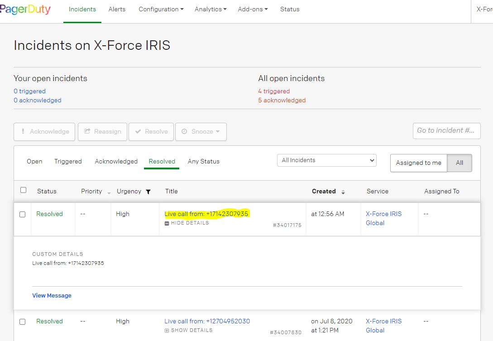
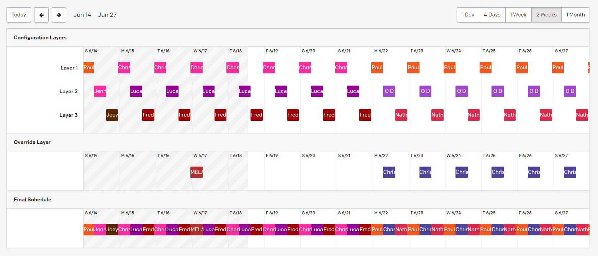
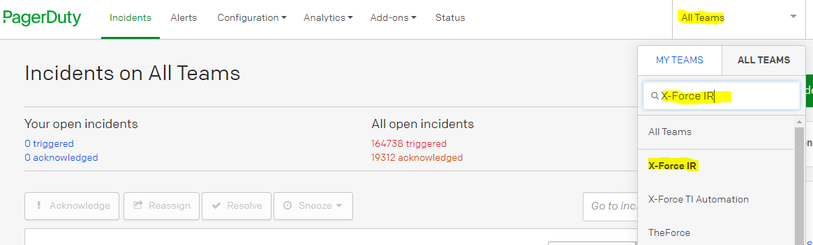
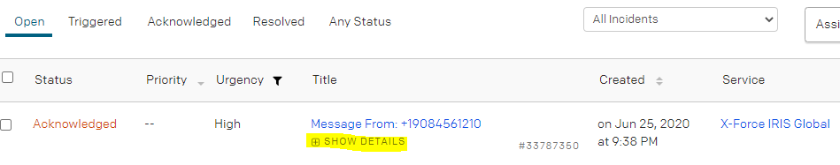
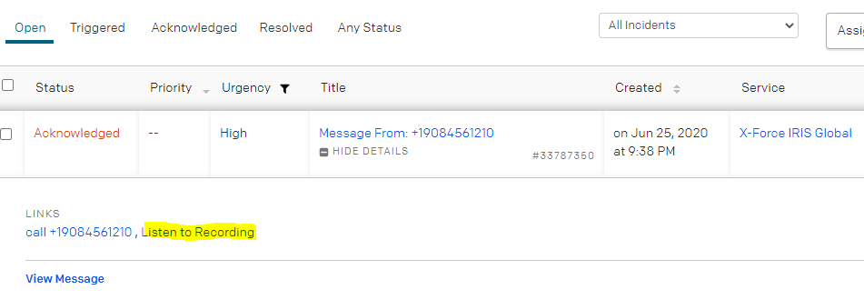
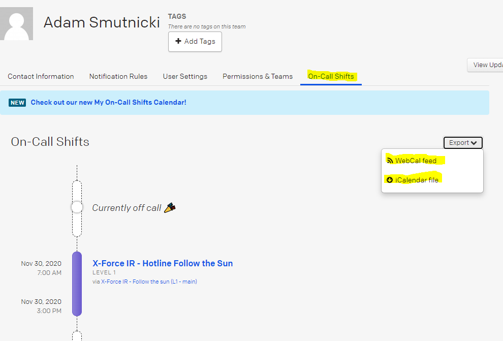
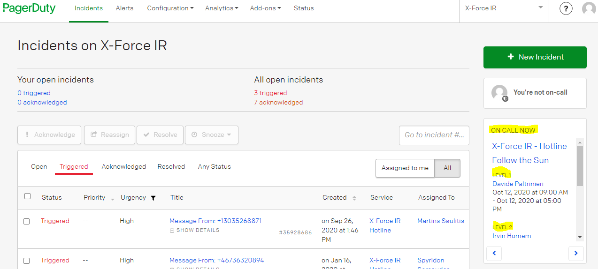

# PagerDuty

## Table of Contents
 1. [**Introduction**](#Introduction)
 2. [**How Does it Work:**](#How-does-it-work)
	- [Integration of Legacy Hotline Systems](#Integration-of-Legacy-Hotline-Systems)
	- [What Happens When a Call Reaches PagerDuty?](#What-Happens-When-a-Call-Reaches-PagerDuty)
	- [Tracking Hotline Calls](#Tracking-Hotline-Calls)
	- [Scheduling](#Scheduling)
 3. [**Newcomer On-boarding**](#Newcomer-on-boarding)
 4. [**Tutorials:**](#tutorials)
	 - [Setting-up Your Environment for the First Time](#Setting-up-your-environment-for-the-first-time)
	 - [Handling Voice Messages](#Handling-Voice-Messages)
	 - [Using Calendar Feeds to Track On-call Schedule](#Using-Calendar-Feeds-to-Track-On-Call-Schedule)
	 - [Checking Who Is Currently On-call](#Checking-Who-Is-Currently-On-call)

## Introduction
XFIR Hotline numbers are maintained by three main regions: EMEA, North America and APAC. Japan operates and maintains Hotline infrastructure independently, therefore all topics discussed on this page are not applicable to Japan. PagerDuty (PD), introduced into XFIR operations in 2018, is an application that facilitates the management of on-call rotations for those three main geographies. 

PagerDuty administrators for XFIR teams are:

| Region | PagerDuty Admin | Alternate |
|--|--|--|
| North America (NA)| Fred Chidsey (fachidse@us.ibm.com) | Phil Harrold (rpharrol@us.ibm.com) |
| Asia-Pacific (APAC) | Amanda Nelson (anelson@au1.ibm.com) | Stephen Burmester (sburmester@au1.ibm.com) |
| Europe, Middle East, & Africa (EMEA) | Adam Smutnicki (adam.smutnicki@pl.ibm.com) | Eben Louw (eben.louw@ibm.com)|

PagerDuty for IBM was deployed as company wide tool and for this reason is shared among multiple teams. There is no sufficient separation between teams and granular enough access control, so no sensitive information can be entered there. Be responsible - make sure you do not interact with configuration for other teams.

Few additional important information:
* PagerDuty IBM instance link: [https://ibm.pagerduty.com/incidents](https://ibm.pagerduty.com/incidents) - log in using your IBM Intranet credentials.
* PagerDuty support inside IBM: pagerduty@us.ibm.com
* Initial setup was built by Adam Smutnicki (adam.smutnicki@pl.ibm.com) from XFIR EMEA - shall you have any questions reach out to him. 
* There is an official mobile (both iOS and Android) PD application and is it recommended to install it - helps handle Hotline calls when you're away from your computer.

## How Does it Work?
### Integration of Legacy Hotline Systems
Practically all hotline numbers are provided by different providers:
- NA and world wide number - RACC
- APAC - Telstra
- EMEA - British Telecom (BT)

It was not possible to transfer Hotline numbers between operators, so to integrate them under one of the providers, we would need to change several hotline numbers. XFIR decided it this is not acceptable scenario and decided to use PD as a central point for integration. All hotline numbers from RACC, Telstra and BT are pointing to a single phone number offered by PD. This way every incoming Hotline call is redirected to PD, which forwards it to mobile phone of a person who is currently on-call. 

XFIR PD hotline number is +44 808 178 1527. One can simply call this number and reach out directly PD system. XFIR has not advertised this number as official XFIR Hotline number using it only for integration.

### What Happens When a Call Reaches PagerDuty?
At first PD replays a configurable welcome message for a caller. The intention of this welcome message is to inform caller what kind of organization was reached, and hope disconnects on his own, if he dialed a wrong number. In the past we used to received a lot of wrong calls, but with introduction of the welcome message, number of them decreased - causing less bother to on call person. Currently configured welcome message is: "*Welcome. This is the IBM X-Force Incident Response Hotline where you can declare an emergency security incident and ask for our assistance.*". After it PD automatically adds a statement informing calling person about attempt to connect to on call person. 

On call person who should receive a Hotline call at given moment in time is defined in PD by a Schedule. To provide fail-over mechanism as described in the [Hotline Operations](DFIR-Hotline.md#Hotline-Operations), two on-call Schedules are configured to represent primary and secondary on-call plan. When a new call arrives to PD, it redirects a call to a primary on-call person determined by "[XFIR - Follow the sun (L1 - main)](https://ibm.pagerduty.com/schedules#PAL8VJX)" schedule (often referenced by team members as L1). If designated person is not available or do not pick up a call within 60 seconds, the call is automatically redirected to a secondary on-call person determined by "[XFIR - Follow the sun (L2 - overflow)](https://ibm.pagerduty.com/schedules#PB084QZ)" schedule (often referenced by team members as L2). If this person is not available or do not pick up a call for 60 seconds, PD will offer calling person an option to leave a Voice Message. Please see section [Handling Voice Messages](#Handling-Voice-Messages) for details on what happens when Voice Message is left by a person calling Hotline. The stack of schedules and VoiceMail is called in PD an "Escalation Path". 

On-call person will receive a call marked with a Hotline caller number (with an exception explained in the [Tracking Hotline Calls](#Tracking-Hotline-Calls)). Upon picking up the call, there will be a message informing that this is a PD calling and you need to press "1" on a phone keyboard to establish a connection with person calling Hotline and so mark this connection as Acknowledged. If a call is not acknowledged, then it will go along the escalation path to second person on call according to L2 schedule. 

All incoming calls will always be routed initially to the first person on-call, then in case of rejection or the time-out limit is reached, it will then be sent to second person on-call. If the Primary person line is busy, PD still may be calling this number (some variations are possible taking into account number of different mobile phone operators in different countries of XFIR team members). In the past XFIR team performed a stress test of the PD, generating significant volume of calls, exceeding several times the highest rate of calls ever observed. It was confirmed that PD can redirect all of them and that in such situation it is an on-call people and their mobile phones who become a "bottleneck", not the PD. Option to leave Voice Message within Pager Duty is the best solution to address high peak of calls. On-call team can process them having detailed trace in PD.

### Tracking Hotline Calls
Every call is recorded as an Incident in PD, which is marked as Acknowledged when on-call person answers it and marked as resolved when call ends. If Hotline call is not picked up, but Voice Message is left, PD will start chasing on-call people from both schedules using mobile app, phone calls and text messages to notify about new Incident in PD (representing a Hotline call) which requires attention. Every PD incident contains a source phone number of a caller, which can be checked in the incident (if you picked up a call, then look within resolved incidents):

For Hotline numbers managed by NA team (NA and worldwide numbers), source phone number will not represent the caller number (most probably will be +18475722285). This is related to the fact how RACC is configured. For this reason, one should not relay entirely on the source phone numbers recorded in PD.

There is one specific case in which PagerDuty will not create an Incident ticket for incoming call: when both on-call assigned people do not answer the call, and the caller does not leave a VoiceMail message. In such a case there is no option to use Incident information to track a hotline call. In such a case, the only source of information is missed call log on a mobile phone of on call person, under a condition that it was not a call to a NA or worldwide hotline number (due to reason stated above).

PD has many functions supporting handling and escalating incidents however due to sensitivity of data processed by XFIR as well as dedicated Resilient instance, PD is used only to handle Hotline calls. 

### Scheduling
On call person is determined using PD Schedules - separate for Primary and Secondary person. Each Schedule consists of three layers, while each layer represents separate geography thus shift. See below picture for reference.

People allocation within each layers is constrained to shift timeframe of this geography (do not confuse layers within a schedule with terms L1/L2 used to name main and backup schedule):
* Layer 1 represents APAC and is limited to timeframe 23:00-07:00 UTC
* Layer 2 represents EMEA and is limited to timeframe 07:00-15:00 UTC
* Layer 3 represents NA and is limited to timeframe 15:00-23:00 UTC.

For this reason each layer in PD is not allocated in a continuous way. Finally, all 3 layers are concatenated into continuous "Final schedule" displayed on the bottom row of the picture. PD is using a "Final Schedule" layer from each schedule to automatically determine current on-call person. Transition between people within a Schedule is performed automatically by PD and do not require any action.

Each Layer has a pool of people allocated (from the same geography), who are automatically assigned using Round Robin algorithm. This means, that people are not able to pick up week which suits them, but they are automatically assigned. This approach removes manual housekeeping work, which was getting complicated as teams were growing. Such approach can lead to a situation, when a person gets allocated to a shift which may collide with future business (eg. customer travel) or private (eg. holiday, family obligations, etc) plans. In such a case, on-call person is responsible to find a replacement:
- find someone willing to support hotline during colliding period,
- or swap part or whole shift with someone. 

By design, schedules are not being modified (eg. by changing order of people) except adding and removing permanently a member from a rotation pool. To address above problem, PD uses a concept of "Schedule override" - it allows to replace on-call person within a schedule by another person. Such override can be set up in advance, for any time period. Example of such situation is visible in the above screenshot - person from Layer 1 is replaced on 17th June by entry in the "Override Layer". We can see that "Final schedule" contains person from "Override layer" instead person configured in "Layer 1". A common approach among team members is to swap whole weeks when there is a bigger collision. Alternatively if Primary person is not available over short period of time, eg. once, just for few hours, either use a short override of Primary person or a notify a Secondary person. 

Due to fact that there is a single configuration for global XFIR team and insufficiently granular rights protecting configuration, number of people who can schedule an override has been limited to ensure sufficient level of protection against mistakes. Currently, overrides can be set up by anyone having a 'Manager' or 'Responder' role - to find necessary contact check out PD XFIR Admins list in the [Introduction](#Introduction) section.

## Newcomer On-boarding
Every new team member who will be supporting Hotline, must configure his mobile phone and PagerDuty profile according to following steps:
1. Log into [PagerDuty](https://ibm.pagerduty.com/incidents) with IBM Intranet credentials, so your account is created.
2. Update your PD profile:
	- enter your IBM mobile number as "Phone number" - this is a number PD will be calling to. It is advised to populate also SMS and email values, as PD is using those channels to escalate missed hotline calls. 
	- set up correct timezone, as all timestamps in PD will be displayed according to the timezone set up in your profile. 
3. Disable personal Voice Mail on your IBM mobile number.
4. Work with your manager, regional IR Functional Lead or your regional Pager Duty admin to be added to an on-call schedules, which includes:
	- adding person to a Global XFIR team in PD,
	- adding to both L1 and L2 schedules.
5. Check when you're on call for the first time.
6. Set up mobile app for your own usage (optional).
7. Read [Tutorials](#tutorials) section below to get familiar with using PD.
8. Set up your PD environment according to below [Tutorials](#tutorials).
9. Reach out to your geography IR Functional Lead or your manager if you have any further questions.

**Disabling personal Voice Mail is critical for Hotline operations**, and everyone should double check that they have it really disabled. Not doing it, can cause severe consequences for XFIR. The last thing we want is a customer leaving message on personal IBM Voice Mail, instead of PD Voice Mail, which is not accessible by other team members. PD Voice Mail has advantage, that everyone can access it and react upon as well as PD will chase other on-call person, which will not happen in case Client leaves message on personal IBM VoiceMail. 

A common practice, is to put new on-call person first as Secondary, allowing him/her to get familiar with Hotline support activity. 

## Tutorials

### Setting-up Your Environment for the First Time
1. Navigate to [https://ibm.pagerduty.com/](https://ibm.pagerduty.com/) and sign in with IBM credentials.
2. On the right part of the screen there is a Team selection option, visible as "All Teams". Unfold it and change your team to X-Force IR. Please keep in mind that there is no separation of IBM teams within PD, which means that everyone sees everything. Change your team, to ensure that all your views contain only items related to our team.

### Handling Voice Messages
Voice Messages can be left by a person calling Hotline, who did not managed to connect to both L1 and L2 person. From a PagerDuty perspective, such ticket is not assigned to anyone and it will be chasing people from Escalation Path to ensure that someone picks it up. This means, that you can received phone calls, text messages and mails from PD, until someone acknowledges this incident (representing a hotline call) and got it assigned to himself. 

VoiceMail message can be listened from a PagerDuty mobile application (both for Android and iOS) or PagerDuty web page.

Using Web GUI:
1. Navigate to Incidents.
2. Under "Open Incidents" section find a relevant hotline connection.
3. Unfold "SHOW DETAILS" without entering into this ticket.

4. Click on "Listen to Recording".

It is very IMPORTANT to resolve PD Incidents having Voice Messages as resolved, as they are not automatically marked as resolved (which happens in case of a hotline call which is picked up by on-call person). This prevents having a left-over incidents in PD.

### Using Calendar Feeds to Track On-call Schedule
Entering "My Profile" settings, it it possible to get WebCal feed or iCalendar file with up-to-date schedule of a personal on-call schedule.

All schedules (L1 and L2) are combined in this feed, so all necessary information are provided in a single place.

### Checking Who Is Currently On-call
Click PagerDuty in the top left corner or navigate to "Incidents". Pane on a right side will contain information who is currently on call.

