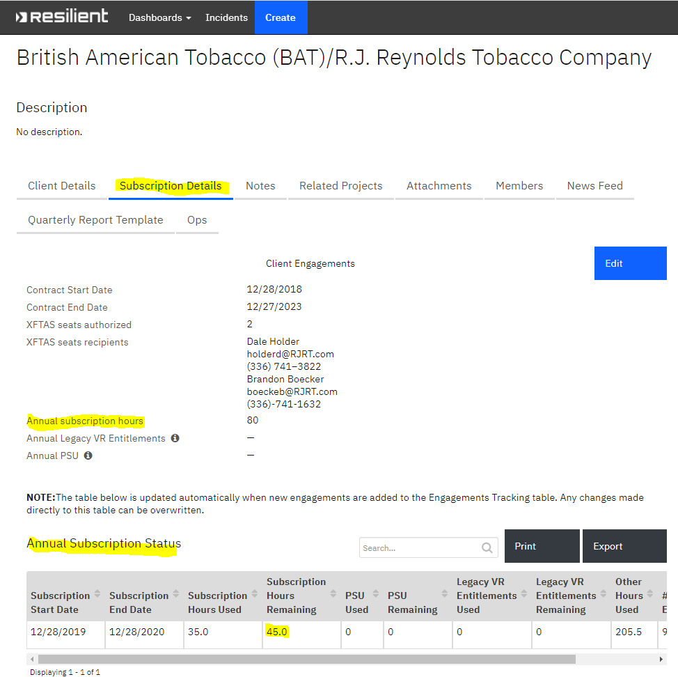
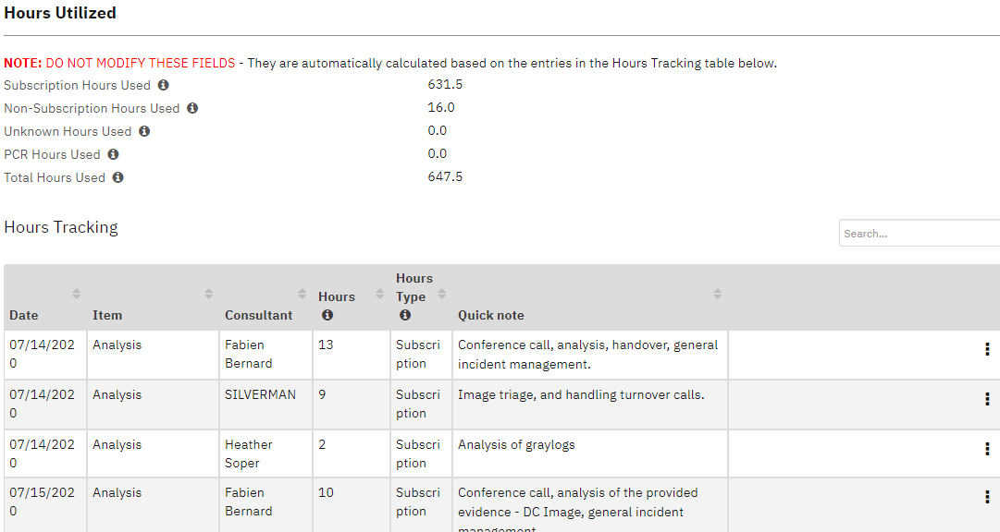
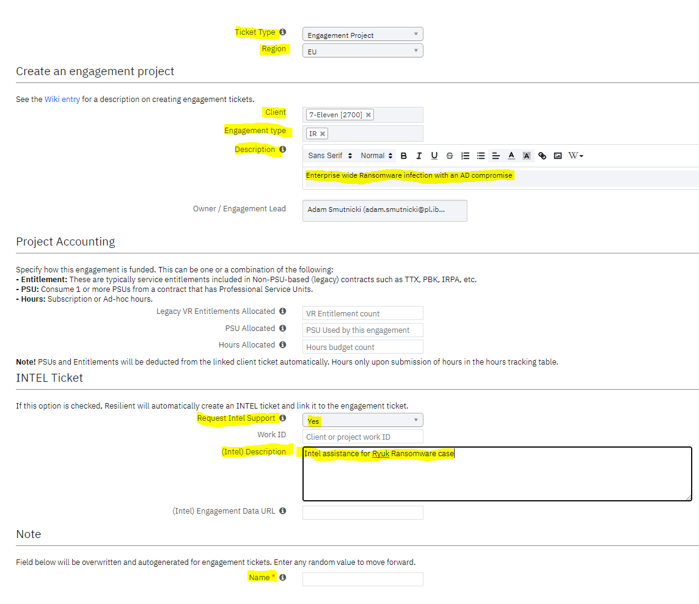

# XFIR Resilient Ticketing

## Table of Contents
1. **[Introduction](#Introduction)**
2. **[Logging Requirements for New IR Engagements](#Logging-Requirements-for-New-IR-Engagements)**
3. **[Tracking Subscriptions Hours Usage](#Tracking-Subscriptions-Hours-Usage)**
4. **[Tutorials](#Tutorials)**
	- [Creating New Engagement Ticket](#Creating-New-Engagement-Ticket)
	- [Finding Details of Incident Declarers](#Finding-Details-of-Incident-Declarers)

## Introduction
XFIR uses customized Resilient instance to:
- track Client entries containing different types of contact points,
- track Client subscription details, including number of remaining subscription hours,
- track every single engagement, both reactive and proactive.

The purpose of this page is to document the XFIR ticketing process only for the DFIR engagements. Details on using Resilient for proactive engagements should be check on respective wikis.

Once XFIR has been engaged for Incident Response services, regardless of the method we are engaged, a Resilient IR engagement ticket needs to be created. This also applies to a cases when it is yet unknown whether XFIR will be engaged, but some actions have already been taken, such as Triage and Scoping Call was already held.

The following documentation is a guideline for the XFIR Resilient ticketing process and is a living document. If there is something you want to see documented here or explained with further detail please contact your geography Functional IR Lead (listed on the [Homepage](Home.md)).

XFIR Resilient instance address: https://xforce-iris.resilientsystems.com. Resilient is not integrated with IBM's w3 Single Sign On, and accounts must be provisioned separately.

## Logging Requirements for New IR Engagements
This section documents fields which must be populated while logging new IR Engagement. 

#### Mandatory fields to be populated during IR ticket creation process:
- "Ticket Type": "Engagement Project"
- "Region": Fill in with correct value.
- "Client": Which client this incident is assigned to. For Ad-hoc incidents, when there is no Client entry, leave it blank (to be populated later).
- "Engagement type": "IR".
- "Description":
	- a **brief** description of incident, eg. "A BEC in UK" or "Ransomware outbreak in the factory in Austria".
	- do **not** use multi-sentence/multi-line descriptions. There are separate fields in Resilient where you can add more text.
	- do **not** include a client name, as there is a separate field dedicated for it (unless this is a ticket temporarily without a Client name)
- "Request Intel Support": Yes (for every single case, even when TI support is not needed - it's for TI visibility into IR engagements)
- "(Intel) Description":
		- make sure it's meaningful (do **not** leave it empty!) - you can change it in the future,
		- if you do not need TI support please enter: "No Intel support needed, just for Intel awareness."
		- if you are unsure, treat it as if you do not need TI support and enter same text as for no support,
		- if you need TI support, enter a brief description, remember this is not a notes field, eg. "Intel assistance for Ryuk Ransomware case"
- "Name": enter random value, will be automatically re-populated by Resilient.

#### Mandatory fields to be populated after IR ticket was created:
- "Engagement Details" tab:
	- Points of contact: fill in contact point details such as name, phone number and mail to most important people from Client side involved into this Engagement (not the same as the person calling the hotline - see next point).
- "Triage worksheet" tab:
	- Contact information: if ticket is created as a result of a Hotline call, details of a person calling Hotline should be filled in here.
	- Incident Details:
		- Discovery: how the incident was discovered.
		- Date discovered: timestamp of a Hotline call
		- Hotline quick notes: provide a description of the incident based on information from person calling the hotline.
	- Expectations: Fill in what client is asking for (eg. on-site, remote, IR, only forensics, what are the investigation goals, etc).
- Members tab:
	- Owner/Account manager: on call person receiving the call. The incident is owned by this person, unless it is handed over to someone else from same or other geography. 
	- Members/Engagement Leads: 
		- Add Account Manager person for this particular Client to ensure that he/she is informed about new engagement. 

Fill in remaining fields depending on availability of information.

## Tracking Subscriptions Hours Usage
Subscription hours usage is summarized in the master Client entry ticket. Navigating to the "Subscription Details" tab, one can obtain all necessary details: number of annual subscription hours, subscription roll-over date and number of subscription hours remaining in a current subscription year.

This figure is calculated from each engagement ticket assigned to the Client. Hours must be entered promptly and accurately for any work performed on an engagement. To do this, open the engagement ticket, select the "Engagement Details" tab, and scroll down to "Hours Utilized".

Follow below requirement while populating hours usage:
- Always provide full name of the person who billed hours,
- Always use the same format of your name and avoid variations (to avoid problems during reporting hours usage),
- Pick an "Item" value to describe type of activity,
- Define "Hours Type" value to ensure that value is properly counted, options are:
	- "Subscription" - for billable hours covering XFIR work consuming subscription hours pool, eg. analysis, Incident Response, report writing, etc.
	- "PCR" (Project Change Request) - for billable hours covering XFIR work, but not consuming subscription hours from the pool due to various reasons - most often because the pool is already empty. In most of the cases this represents a pool of additional hours purchased by customer to cover additional time over what was available in their retainer.
	- "Non-subscription" - for other billable hours, which do not consume subscription hours from the pool, eg. time spent on triage. More details on how to claim triage time are available [here](DFIR-Triage-Scoping.md#Claiming).
- Enter hours in a daily breakdown,
- Hours usage should be consistent with what was entered into Claim systems,
- Add a "Quick note" to describe the activity or work performed.

Hours usage for each engagement should be populated at least on the weekly basis together with Claiming those hours in IBM systems.

When counting hours against subscription usage, Resilient is not using a date when hours were consumed, but the date when the engagement ticket was created. For this reason, if an engagement is close to the end of subscription year, Resilient may erroneously count hours consumed in the new year against the previous year. There is no notification if the number of available hours from previous year is exceeded, so this needs to be monitored manually.

## Tutorials

### Creating New Engagement Ticket
This section provides a technical guide on how to create an IR Engagement ticket in Resilient. Ticket creation form contains only several most important fields and additional values can be added after ticket was created. Section  [Logging Requirements for New IR Engagements](#Logging-Requirements-for-New-IR-Engagements) describes how to populate necessary fields and which are mandatory.

To create a new ticket follow below steps:
 1. Click "Create" from top horizontal menu in Resilient.
 2. Choose "Ticket Type": "Engagement Project".
 3. Populate all fields marked in yellow on the below screenshoot following guidelines described in section [Logging Requirements for New IR Engagements](#Logging-Requirements-for-New-IR-Engagements).

Example:

### Finding Details of Incident Declarers
Each Client entry should contain contact points designated as Incident Declarers during onboarding process. However, in the past there were situations when there were no Incident Declarers or listed ones have already left the organisation. It is not possible to provide clearly defined guidelines for such a case and one should use a common sense to determine who should be reached from list of contact points. Some recommendations on who should be contacted to somehow replace Incident Declarer if such a person is not defined:
- from Client: IR/Security management,
- on IBM Account side: Project Executive (PE), Delivery Project Executive (DPE) or their variations having Security in the name (Security PE, Security DPE) - they should be able to provide necessary contact from a Client side to ensure necessary approvals,
- Account Manager (term used in EMEA) or Delivery Lead (term in NA) may be able to provide necessary contact points, or even look at who signed contracts or provided SOWs.

In the Resilient all points of contact are listed in the main Client entry - scroll down main page of Client entry (designated by "Client Details" in the horizontal menu) to "Contact" and "Points of contact" section containing table. Person who has Incident Declarer role assigned by a Client should have a "Incident Declarer" tag in the "Type" column. 
