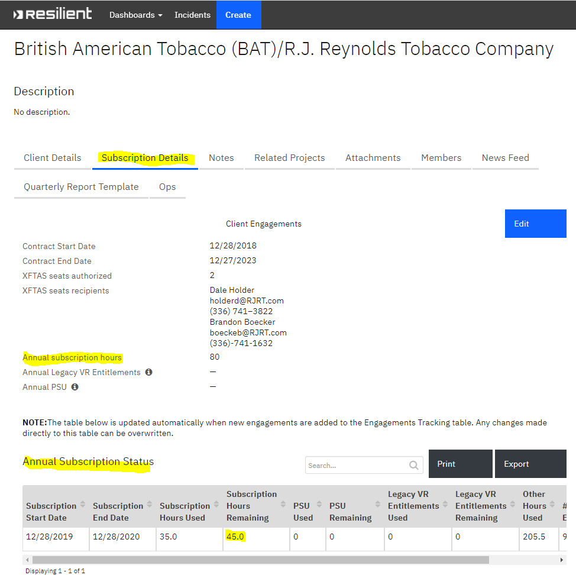
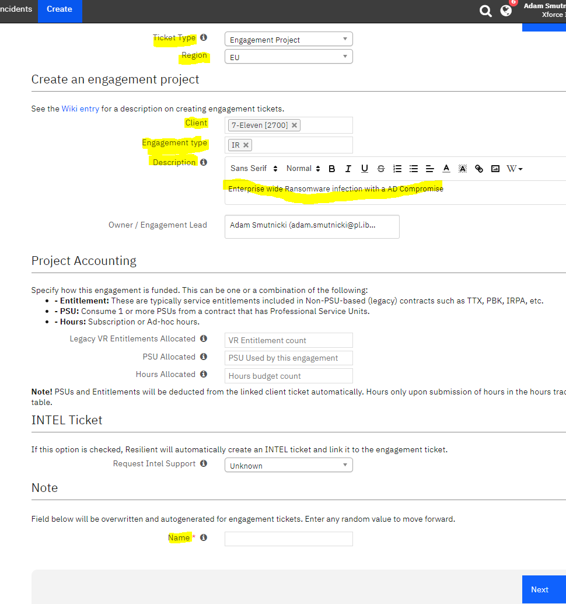

# XFIR Resilient Ticketing Process

## Table of Contents
1. **[Introduction](#Introduction)**
2. **[Logging Requirements for New IR Engagements](#Logging-Requirements-for-New-IR-Engagements)**
3. **[Tracking Subscriptions Hours Usage](#Tracking-Subscriptions-Hours-Usage)**
4. **[Tutorials](#Tutorials)**
	- [Creating New Engagement Ticket](#Creating-New-Engagement-Ticket)
	- [Finding Details of Incident Declarers](#Finding-Details-of-Incident-Declarers)

## Introduction
The purpose of this page is to document the XFIR ticketing process. XFIR uses customized Resilient instance to:
- track Client entries containing different types of contact points,
- track Client subscription details, including number of remaining subscription hours,
- track every single engagement.

Once XFIR has been engaged for Incident Response services regardless of the method we are engaged, a Resilient IR engagement ticket needs to be created.

The following documentation is a guideline for XFIR consultants for the XFIR Resilient ticketing process and is a living document. If there is something you want to see documented here or explained with further detail please contact your geography Functional IR Lead (listed on the [Homepage](Home.md)).

XFIR Resilient instance is located here: https://xforce-iris.resilientsystems.com. Use w3 IBM Intranet credentials to log in.

## Logging Requirements for New IR Engagements
Following fields must be populated while logging New IR Engagement (this means that some fields needs editing after Resilient ticket was created):
- Engagement Details tab:
	- Description:
		- a **brief** description of incident, eg. "A BEC in UK" or "Ransomware outbreak in the factory in Austria".
		- Do **not** use multi sentence/multi line descriptions. There are separate fields where you can add more text.
		- there is no need to add client name, as there is a separate field dedicated for it.
	- Engagement type: "IR".
	- Region: Fill in with correct value.
	- Client: Client this incident is assigned to. For Ad-hoc incidents, a new Client ticket should to be created.
	- Points of contact: fill in contact point details such as name, phone number and mail to most important people from Client side.
- Triage worksheet tab:
	- Contact information: if ticket is created as a result of a Hotline call, details of a person calling Hotline should be filled in here.
	- Incident Details:
		- Discovery: how incident was discovered.
		- Date discovered: timestamp of a hotline call
		- Hotline quick notes: provide description of incident based on information from person calling hotline.
	- Expectations: Fill in what client is asking for (eg. on-site, remote, IR, only forensics, what are the investigation goals, etc).
- Members tab:
	- Owner/Account manager: on call person receiving the call. The incident is owned by this person, unless it is handed over to someone else from same or other geography. This should not be Account Manager (XFIR consultant assigned to this customer).
	- Members/Engagement Leads: 
		- Add Account Manager person for this particular Client to ensure that he/she is informed about new engagement. 
			- In EMEA all Clients have "Owner / Account Manager" set to Neil Jones, who is XFIR EMEA Ops Manager. The Account Manager who should be added to every new incident ticket is listed as "Members / Engagement Leads" in Resilient Client ticket. 

Fill in remaining fields depending on availability of information.

## Tracking Subscriptions Hours Usage
Subscription hours usage is summarized in the master Client entry ticket. Navigating to the "Subscription Details" tab, one can obtain all necessary details: number of annual subscription hours, subscription roll-over date and number of subscription hours remaining in a current subscription year.

However, details of the hours usage related to particular engagement are tracked in this engagement ticket - at the bottom of the "Engagement Details" tab, there is a section "Hours Utilized" where hours usage should be filled in.

Fill in hours usage according to below requirements:
- always provide full name of the person who billed hours,
- always used the same format of your name, so avoid variations,
- pick up "Item" value to describe type of activity,
- define "Hours Type" value to ensure that value is properly counted, options are:
	- "Subscription" - for billable hours covering XFIR work consuming subscription hours pool, eg. analysis, Incident Response, report writing, etc.
	- "PCR" - for billable hours covering XFIR work, but not consuming subscription hours pool due to various reasons - most often because the pool is already empty. In most of the cases represents a pool of additional hours purchased by customer to cover time over what was available in VR.
	- "Non-subscription" - for other billable hours, which do not consume subscription hours pool, eg. time spent on triage. More details on how to claim triage time are available [here](DFIR-Triage-Scoping.md#Claiming).
- enter hours in a daily breakdown,
- hours usage should be consistent with what was entered into Claim systems
- add "Quick note" if necessary.

Hours usage for each engagement should be populated at least on the weekly basis together with Claiming those hours in IBM systems.

When counting hours against subscription usage, Resilient is not using a date when hours were consumed, but date when engagement ticket was created. For this reason, if engagement is close to the end of subscription year, it may happen that hours consumed in the new year, are counted against previous year. There is no protection or notification if by mistake number of hours from previous year is exceeded. 

## Tutorials

### Creating New Engagement Ticket
This process is responsible to create an IR Engagement ticket, which then should be populated further with available information. To create a new ticket (screenshot with example provided below):
 1. Click "Create" from top horizontal menu in Resilient.
 2. Choose "Ticket Type": "Engagement Project"
 3. Fill in correct "Region"
 4. Find Client name from base of existing entries (start typing for suggestions). For Ad-hoc cases, a new Client Entry needs to be created to be able to pick it up. This is not "type value" field.
 5. Pick up "IR" tag from "Engagement type" field.
 6. Description - a brief, high level statement of what kind of incident it is. Follow guidelines from [Logging Requirements for New IR Engagements](#Logging-Requirements-for-New-IR-Engagements) section.
 7. "Name" under "Notes" is automatically populated to just enter some random value.

Example:

All other fields needs to be populated after ticket is created.

### Finding Details of Incident Declarers
Each Client entry should contain contacts points designated as Incident Declarers during onboarding process. However, in the past there were situations when there were no Incident Declarers or listed ones have already left the organisation. It is not possible to provide a clearly defined guidelines for such a case and you should use a common sense to determine who should be reached from list of contact points. Some recommendations on searching suitable contact points:
- IR/Security management on a Client side,
- on IBM Account side: Project Executive (PE), Delivery Project Executive (DPE) or their variations having Security in the name (Security PE, Security DPE) - they should be able to provide necessary contact from a Client side to ensure necessary approvals,
- Account Manager (term used in EMEA) or Delivery Lead (term in NA) may be able to provide necessary contact points.

All points of contacts are listed in the main Client entry - scroll down main page of Client entry (Designated by "Client Details" in the horizontal menu) to "Contact" and "Points of contact" section containing table. Person who has Incident Declarer role assigned by a Client will have a "Incident Declarer" tag in the "Type" column. 