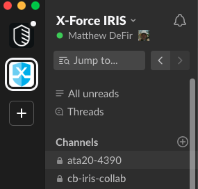

# XFIR Incident Response Spin-Up Process

## Table of Contents
1. [**Introduction**](#Introduction)
2. [**Setting up Collaboration Environment**](#Setting-up-Collaboration-Environment)
	- [Internal XFIR Working Environment](#Internal-XFIR-Working-Environment)
	- [Environment for Data Sharing with a Client](#Environment-for-Data-Sharing-with-a-Client)
3.  [**Threat Intel Team Support**](#Threat-Intel-Team-Support)
4. [**Endpoint Detection and Response Deployment**](#Endpoint-Detection-and-Response-Deployment)
5. [**Tutorials**](#Tutorials)
	- [Slack](#Slack)
	- [IBM Box Folder for Case Data](#IBM-Box-Folder-for-Case-Data)
	- [IBM Box Folder for Digital Evidence](#IBM-Box-Folder-for-Digital-Evidence)
	- [Aspera](#Aspera)

## Introduction
The purpose of this page is to document the XFIR Incident Response Service Spin-Up process and procedures. This is is a living document. If there is something you want to see documented here or explained with further detail please contact your geography Functional IR Lead (listed on the  [Homepage](Home.md)).

Once XFIR has been engaged for Incident Response services regardless of the scope and size of that effort there are some fundamental procedures that are required for every IR engagement. In addition to the basic IR engagement spin-up, and depending on several factors, there are a number of procedures that could also apply to your engagement that will be documented here.

## Setting up Collaboration Environment
All technical details how to perform steps required in this section and best practices on using them, are described in the [Tutorials](#Tutorials) section below.
### Internal XFIR Working Environment
Proceed with following steps to set up working environment for collaboration within XFIR (all steps are obligatory, unless stated otherwise):
1. Create a central repository of all data regarding IR engagement, by creating a dedicated IBM Box folder:
	- IMPORTANT: do not use this folder for digital evidence storage, share data with Client or any third party! This topic is addressed separately in section [Environment for Data Sharing with a Client](#Environment-for-Data-Sharing-with-a-Client).
	- use a "IR_Engagement_Folder_Template_DONOTMODIFY" (simply using copy option in Box) for the case folder structure from [here](https://ibm.ent.box.com/folder/63956024543),
	- create a case folder in a location specific for each geography: [EMEA](https://ibm.ent.box.com/folder/41834082550), [NA](), [APAC](). (2DO: populate links)
	- rename template of the case folder to a case number: 'IRXX-YYYY (uppercase!; do not append anything in the folder name after a case number),
2. Download Evidence Tracking Sheet (ETS) Template from [here](DFIR/IBM%20X-Force%20IR%20Engagement%20Tracking%20Sheet.xlsx) and place is the IBM Box case folder created in the previous step (root of the case folder).
3. Create a dedicated channel for this engagement within X-Force IRIS Slack workspace for regular communication about the case:
	- channel name must be equal to a case number - "irXX-YYYY" (Slack channels are always named with lowercase letters)
	- for small engagements, where there is only one person assigned and working individually, there is no need to create a Slack channel.
4. Grant access to consultants assigned to this page:
	1. Populate an "Owner" field in Resilient with Case Lead name.
	2. Populate "Members" field in Resilient with consultant assigned to this case.
	3. Add people to Slack channel from X-Force IR or TI or RE teams.

### Environment for Data Sharing with a Client
Evidence Delivery in most of the cases is performed over the Internet, using one or more of below methods:
1. dedicated IBM Box folder for evidence upload (this is not the case IBM Box folder created above),
	- 2DO: SOME REQUIREMENTS
2. IBM Aspera folder or package,
	- 2DO: SOME REQUIREMENTS
4. EMEA only: SFTP,
5. NA only: Forensics Lab,

## Threat Intel Team Support
Threat Intel (TI) and Reverse Engineering (RE) teams provide support for IR engagements. To get their support, proceed with following steps:
1. Use instructions provided on a [Intel Ticketing](DFIR-IntelTicketing.md) page to request TI and/or RE assistance.
2. Add TI/RE team members assigned to this case yo the case Slack channel.

## Endpoint Detection and Response Deployment
TODO:
- How to request EDR.
- to be unified with ATA wiki, to avoid duplication

## Tutorials

### Slack
When creating your Engagement Slack channel make sure you are in the  `X-Force XFIR`  Slack workspace  `x-forceiris.slack.com`. General rules to help keep the clutter down and to avoid potential issues are as following:
-   Use  `Threads`  in your engagement channel. This will help keep the noise down as well as resolve potential issues with information taken out of context.
-   Keep topics not related to the engagement out of the main engagement channel.
-   Limit the members of your engagement channel to the members that need to know.
-   When posting analysis findings do not post a wall of text. If the data is longer than a paragraph of textual data just upload that to the channel in a text document and then provide the context about that finding in a comment.
-   Do not post sensitive client information in the engagement channel. Use your best judgement and follow best practices for handling of data this includes but is not limited to:
    -   PII/PHI,
    -   PCI/Track Data,
    -   Client Data/Documents of proprietary nature.
-   When posting URLs or IP addresses from analysis findings make sure you aren't posting a "Hot Link" that someone could potentially click on.
    -   IP addresses should be "de-fanged" or formatted, eg:  `192.168.45[.]22`
    -   URLs should not be "clickable":  `hxxp://yahoo[.]com`

Once the channel is created, it is possible to add members. To create a new Slack channel:
1.  Click `+` on the right hand side of `Channels` section or if it is not visible, hover `Channels` section header which should cause `+` to appear and click it.

2. Pick up an option "Create a channel".
3. Fill in details of a new channel:
	- name channel using a case number: irXX-YYYY,
	- Select `Make Private`
	- Fill in description providing customer name and brief description of the case, eg. "BEC case of 2 accounts for MyCompany"
[!Details of the new Slack channel](DFIR/screenshots/Slack_03.png)

### IBM Box Folder for Case Data
1. https://ibm.ent.box.com/folder/63956024543
2. Pick "Move or Copy" from 3 dots menu for template folder

3. Pick up a destination of the folder (engagements folder specific for each geography listed above) and click "Copy".

4. Navigate to a destination where folder was created, you may receive a green pop-up at the bottom of the page with option to show newly created folder.

5. Rename created folder according to requirements provided in the section [Setting up Collaboration Environment](#Setting-up-Collaboration-Environment). 

### IBM Box Folder for Digital Evidence

### Aspera
https://ibm.ibmaspera.com/

Troubleshooting Aspera
Visit https://test-connect.asperasoft.com/ to test connections or 
https://www.ibm.com/support/pages/node/746389 for firewall information.

############################################################

# General IR Spin-Up Procedures

3.  Update the  [Resilient Engagement Ticket](https://github.ibm.com/XFIR/DFIR-wiki/blob/development/DFIR-SpinUp.md#resilient-engagement-ticket)  early and often. Resilient is the primary client and engagement management tool we use at XFIR.

We log and track hours, reporting and QA tasks, communications between XFIR and the client, engage Intel and much more using Resilient. Visit the  [Resilient Overview](https://github.ibm.com/XFIR/DFIR-wiki/wiki/XFIR-Resilient)  for more information.

4.  Every IR engagement requires an  [Intel Engagement Ticket](https://github.ibm.com/XFIR/DFIR-wiki/blob/development/DFIR-SpinUp.md#intel-engagement-ticket). When we engage Intel for malware analysis, dark-web analysis, or any other Intel specific task related to an IR engagement, that work needs to be tracked and associated with an  `Engagement Work`  Intel ticket.

## Resilient Engagement Ticket

Updating the  `Resilient Engagement Ticket`  is the primary engagement management function required from end-to-end on any IR engagement. If the client is engaging us after they called the Hotline there should already be  `Hotline Triage`  ticket at this point. If this is the case, simply add the  `IR`  tag and make sure the  `Triage Worksheet`,  `Notes`, and  `Engagement Members`  are updated.

If the client has engaged us through other means you will need to create an engagement ticket. For more information on the  `IR Ticketing Process`  go  [here](https://github.ibm.com/XFIR/DFIR-wiki/wiki/XFIR-IR-Resilient).

For more information on Resilient in general visit the  [Resilient Overview](https://github.ibm.com/XFIR/DFIR-wiki/wiki/XFIR-Resilient)

Some general rules and best practices for engagement management in Resilient:

-   Update hours associated with an engagement project everyday. It is difficult for the  `Engagement Lead`  to properly manage resources and tasking when the consumption of hours are not accurately recorded in a timely fashion.
-   Use the  `Notes`  tab to record significant developments within the engagement project. It is recommended to log significant client communications and engagement tasking within the  `Notes`  tab.
-   Use the attachments tab to upload status updates, draft and final reports, as well as the engagement tracking sheet periodically or upon completion of the IR engagement.

## Intel Engagement Ticket

All XFIR engagements of the type  `IR`  require an initial  `Engagement Work`  Intel ticket. Intel uses Jira for ticketing and associates additional tickets created in support of an engagement with this initial  `Engagement Work`  ticket. For example, if you submit three malware analysis tickets for your engagement, Intel will track the relationship between those tickets through the initial Intel ticket.

This makes the task of tracking those tickets easier for Intel and facilitates better workflow between IR consultants and Intel analysts working on an engagement together. XFIR uses functionality within Resilient to create and associate these tickets with our client engagements. For more information see the  [Intel Analysis Ticketing](https://github.ibm.com/XFIR/DFIR-wiki/wiki/XFIR-IR-IntelTicketing)  section.

# Situational IR Spin-Up Procedures

No two IR engagements are the same, some will require additional infrastructure and considerations to support the effort. For example, the client might prefer to use their own data transfer solution instead of ours (_Box/Aspera_). The engagement could require deployment of Endpoint Detection and Response (EDR) technology or in some cases, just analysis of logs or forensic images.

You may need to perform one or more of these additional spin-up processes and not necessarily in any particular oder or timeframe depending the dynamic nature of incident response.

1.  [Client Data Transfer](https://github.ibm.com/XFIR/DFIR-wiki/blob/development/DFIR-SpinUp.md#client-data-transfer)
2.  [Technology Deployment](https://github.ibm.com/XFIR/DFIR-wiki/blob/development/DFIR-SpinUp.md#technology-deployment)
3.  [Data Acquisition](https://github.ibm.com/XFIR/DFIR-wiki/blob/development/DFIR-SpinUp.md#data-acquisition)
4.  [On-Site Support](https://github.ibm.com/XFIR/DFIR-wiki/blob/development/DFIR-SpinUp.md#on-site-support)
5.  [Forensic LAB Support](https://github.ibm.com/XFIR/DFIR-wiki/blob/development/DFIR-SpinUp.md#forensic-lab--support)

## Client Data Transfer

In most cases, you will need to establish some method of secure data transfer with the client. If the client does not wish to use their own data transfer method we can use Box or Aspera to facilitate the transfer. If the client does not wish to share data remotely for security or privacy concerns, we can suggest other methods such as shipping data to the  [Forensic LAB](https://github.ibm.com/XFIR/DFIR-wiki/blob/development/DFIR-SpinUp.md#forensic-lab-support)  on encrypted medium, or  [OnSite Support](https://github.ibm.com/XFIR/DFIR-wiki/blob/development/DFIR-SpinUp.md#onsite-support). In either case, it is our duty to handle client data in a secure manner and adhere to local

It should be noted that Box and Aspera have different file size and bandwidth limitations. Your choice of solution could be driven by those factors.

-   Box
    -   Maximum File Size:
    -   Bandwidth Limitations:
-   Asper

The following is a guide for setting up and sharing a data transfer folder with your client:

-   [Client Data Transfer via Box](https://github.ibm.com/XFIR/DFIR-wiki/blob/development/DFIR-SpinUp.md#client-data-transfer-via-box)
-   [Client Data Transfer via Aspera](https://github.ibm.com/XFIR/DFIR-wiki/blob/development/DFIR-SpinUp.md#client-data-transfer-via-aspera)

### Client Data Transfer via Box

Setting up Box for data transfer is simple and secure. If your client has questions about data privacy and security as it relates to Box you can refer them to the official  [Box Security Whitepaper](https://cloud.app.box.com/s/igvy6orjgbhg8oxjn967s54x4py23st9). If the client needs additional information about IBM or XFIR specific data security and privacy procedures check the  _**Data Privacy and Retention**_  page for more resources.

To create a new Client Data Transfer folder use the following instructions:

1.  Browse to the URL  [https://ibm.ent.box.com/folder/0](https://ibm.ent.box.com/folder/0)

_Note: You will need to be on IBM VPN to access your Box account._

Once you've authenticated you should see something similar to the following:

2.  Create a folder within the root of your Box access  `https://ibm.ent.box.com/folder/0`  and name it accordingly. You can do this by selecting  `New`  from the options in the upper right hand of the page and select  `Folder`

3.  Name the folder accordingly and then add the relevant contacts from your client and hit  `create`. Make sure to set the permissions to  `Viewer Uploader`  unless you specifically need the client to have editing functionality.

Once you've created the folder, whoever you shared the folder with will receive an email informing them of your collaboration folder and a link to Box. They will then need to either create a free Box account using the same email or authenticate to an existing Box account under that email.

You can always add or remove additional collaborators and change permissions for users within a Box folder. It is best practice to limit the collaborators to individuals who have a need to know and handle the subject data.

Once the engagement is complete and unless data retention is requested by the client or client's counsel. The data transfer folder should be deleted. For specific information regarding XFIR data retention policy see the  _**Data Privacy and Retention**_  page.

Other Box considerations and tips:

-   Turn on upload/download notifications for your data transfer folder to receive email alerts when someone uploads or downloads a file.
-   If a specific file is relevant to other XFIR members on your engagement, consider copying that file to the  `Data Provided by Client`  folder within the  `Engagement Box Folder`  for your engagement instead of adding and managing permissions on the data transfer folder.
-   The client data transfer folder is simply a mechanism for clients to provide data to XFIR remotely and securely and should not be used as a "working" folder. One exception to this could be a shared Box note or document between XFIR and the client for syncing tasks and efforts.
