# XFIR Incident Response Spin-Up Process

## Table of Contents
1. [**Introduction**](#Introduction)
2. [**Setting up Collaboration Environment**](#Setting-up-Collaboration-Environment)
	- [Internal XFIR Working Environment](#Internal-XFIR-Working-Environment)
	- [Environment for Data Sharing with a Client](#Environment-for-Data-Sharing-with-a-Client)
3.  [**Threat Intel Team Support**](#Threat-Intel-Team-Support)
4. [**Endpoint Detection and Response Deployment**](#Endpoint-Detection-and-Response-Deployment)
5. [**Tutorials**](#Tutorials)
	- [Slack](#Slack)
	- [IBM Box Folder for Case Data](#IBM-Box-Folder-for-Case-Data)
	- [IBM Box Folder for Digital Evidence](#IBM-Box-Folder-for-Digital-Evidence)
	- [Aspera](#Aspera)
		- [Creating a Folder for an Aspera Upload](#Creating-a-Folder-for-an-Aspera-Upload)
		- [Troubleshooting Aspera](#Troubleshooting-Aspera)

## Introduction
The purpose of this page is to document the XFIR Incident Response Service Spin-Up process and procedures. This is is a living document. If there is something you want to see documented here or explained with further detail please contact your geography Functional IR Lead (listed on the  [Homepage](Home.md)).

Once XFIR has been engaged for Incident Response services regardless of the scope and size of that effort there are some fundamental procedures that are required for every IR engagement. In addition to the basic IR engagement spin-up, and depending on several factors, there are a number of procedures that could also apply to your engagement that will be documented here.

## Setting up Collaboration Environment
All technical details how to perform steps required in this section and best practices on using them, are described in the [Tutorials](#Tutorials) section below.
### Internal XFIR Working Environment
Proceed with following steps to set up working environment for collaboration within XFIR (all steps are obligatory, unless stated otherwise):
1. Create a central repository of all data regarding IR engagement, by creating a dedicated IBM Box folder:
	- IMPORTANT: do not use this folder for digital evidence storage, share data with Client or any third party! This topic is addressed separately in section [Environment for Data Sharing with a Client](#Environment-for-Data-Sharing-with-a-Client).
	- use a "IR_Engagement_Folder_Template_DONOTMODIFY" (simply using copy option in Box) for the case folder structure from [here](https://ibm.ent.box.com/folder/63956024543),
	- create a case folder in a location specific for each geography: [EMEA](https://ibm.ent.box.com/folder/41834082550), [NA](), [APAC](). (2DO: populate links)
	- rename template of the case folder to a case number: 'IRXX-YYYY (uppercase!; do not append anything in the folder name after a case number),
2. Download Evidence Tracking Sheet (ETS) Template from [here](DFIR/IBM%20X-Force%20IR%20Engagement%20Tracking%20Sheet.xlsx) and place is the IBM Box case folder created in the previous step (root of the case folder).
3. Create a dedicated channel for this engagement within X-Force IRIS Slack workspace for regular communication about the case:
	- channel name must be equal to a case number - "irXX-YYYY" (Slack channels are always named with lowercase letters)
	- for small engagements, where there is only one person assigned and working individually, there is no need to create a Slack channel.
4. Grant access to consultants assigned to this page:
	1. Populate an "Owner" field in Resilient with Case Lead name.
	2. Populate "Members" field in Resilient with consultant assigned to this case.
	3. Add people to Slack channel from X-Force IR or TI or RE teams.

### Environment for Data Sharing with a Client
Remote Evidence Collection, together with all supporting materials, is documented on the [Digital Evidence](DFIR-Digital-Evidence.md) page.
Evidence Delivery in most of the cases is performed over the Internet. The best option is when Client shares evidence using their own infrastructure. However, often they do not have sufficient capabilities. For this reason XFIR can offer to use one or more of below methods.
1. dedicated IBM Box folder for evidence upload (this is not same as the case IBM Box folder created above):
	- is an ultimate target for evidence - all evidence should be finally put into this folder,
	- maximum file size: 32 GB,
	- "need to know" privilege implemented by adding only XFIR consultants working for this case,
	- folder must be named "IRXX-YYYY-Evidence" in the root folder of a consultant's IBM Box:
		- invite only XFIR people working on this case with "Co-owner" rights,
		- do not create it within a team shared part of IBM Box,
	- create a "IRXX-YYYY-Evidence/Client Upload" folder:
		- allows to move uploaded files to a root folder of "IRXX-YYYY-Evidence", so that files are not widely shared,
		- invite people for an upload with "Previewer Uploader" rights, so they confirm that files have been uploaded,
	- do not send Box invites to Free email providers (eg. Gmail, Hotmail) as they are banned from accessing IBM's Box and will violate IBM ITCS300 Security Policy.
	- see [tutorial](#IBM-Box-Folder-for-Digital-Evidence) below.
2. IBM Aspera folder (optional):
	- folder must be named “IRXX-YYYY-Evidence”
	- should be considered ONLY for transition as data are deleted after 7 days:
		- make sure smaller files (under Box size limit) are uploaded directly to Box,
		- for larger files (above Box limit), download them from Aspera, split into chunks (eg. with 7zip) and upload to IBM Box,
	- invite only XFIR people working on this case with assigning them "Edit" rights in the Aspera menu,
	- invite Client representatives:
		- always attempt to invite people by mail, assigning them only following rights: "Browse", "Upload files" and "Create folders",
		- whenever possible, avoid using "Shared links" as once a shared link is created the permissions cannot be downgraded,
	 	- as a last resort if there are no other options upload can be anonymous via shared links.
	- other considerations:
		- no file size limit,
	 	- requires Web Browser plugin and software installation,
	 	- may require some firewall changes on a Client side (see [Troubleshooting Aspera](#Troubleshooting-Aspera) below),
		- do not use Aspera "Package" option, as it is deleted immediately after successful download, making it impossible to forward to another XFIR consultant. Always use "Files".
 	- see [tutorial](#Aspera) below.
3. NA only: Forensics Lab,

Currently, none of the tools is GDPR compliant. Alternatively, digital evidence can be physically shipped to XFIR consultant or NA Forensics Lab. If Client do not agree to share digital evidence outside it's location, the only available solution would be on-site support.

## Threat Intel Team Support
Threat Intel (TI) and Reverse Engineering (RE) teams provide support for IR engagements. To get their support, proceed with following steps:
1. Use instructions provided on a [Intel Ticketing](DFIR-IntelTicketing.md) page to request TI and/or RE assistance.
2. Add TI/RE team members assigned to this case yo the case Slack channel.

## Endpoint Detection and Response Deployment
TODO:
- How to request EDR.
- to be unified with ATA wiki, to avoid duplication

## Tutorials

### Slack
When creating your Engagement Slack channel make sure you are in the  `X-Force XFIR`  Slack workspace  `x-forceiris.slack.com`. General rules to help keep the clutter down and to avoid potential issues are as following:
-   Use  `Threads`  in your engagement channel. This will help keep the noise down as well as resolve potential issues with information taken out of context.
-   Keep topics not related to the engagement out of the main engagement channel.
-   Limit the members of your engagement channel to the members that need to know.
-   When posting analysis findings do not post a wall of text. If the data is longer than a paragraph of textual data just upload that to the channel in a text document and then provide the context about that finding in a comment.
-   Do not post sensitive client information in the engagement channel. Use your best judgement and follow best practices for handling of data this includes but is not limited to:
    -   PII/PHI,
    -   PCI/Track Data,
    -   Client Data/Documents of proprietary nature.
-   When posting URLs or IP addresses from analysis findings make sure you aren't posting a "Hot Link" that someone could potentially click on.
    -   IP addresses should be "de-fanged" or formatted, eg:  `192.168.45[.]22`
    -   URLs should not be "clickable":  `hxxp://yahoo[.]com`

Once the channel is created, it is possible to add members. To create a new Slack channel:
1.  Click `+` on the right hand side of `Channels` section or if it is not visible, hover `Channels` section header which should cause `+` to appear and click it.

2. Pick up an option "Create a channel".
3. Fill in details of a new channel:
	- name channel using a case number: irXX-YYYY,
	- Select `Make Private`
	- Fill in description providing customer name and brief description of the case, eg. "BEC case of 2 accounts for MyCompany"

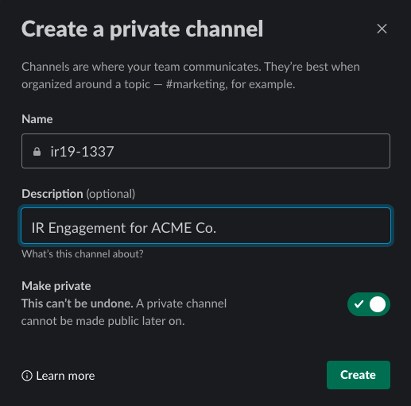

### IBM Box Folder for Case Data
1. Navigate to a folder containing case folder template "IR_Engagement_Folder_Template_DONOTMODIFY" https://ibm.ent.box.com/folder/63956024543
2. Pick "Move or Copy" from 3 dots menu for template folder

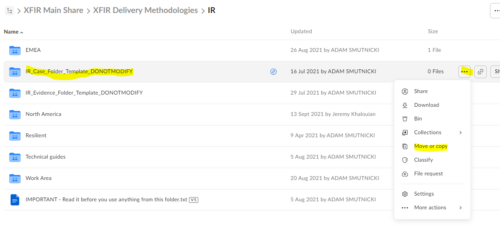

3. Pick up a destination of the folder (engagements folder specific for each geography listed above) and click "Copy".

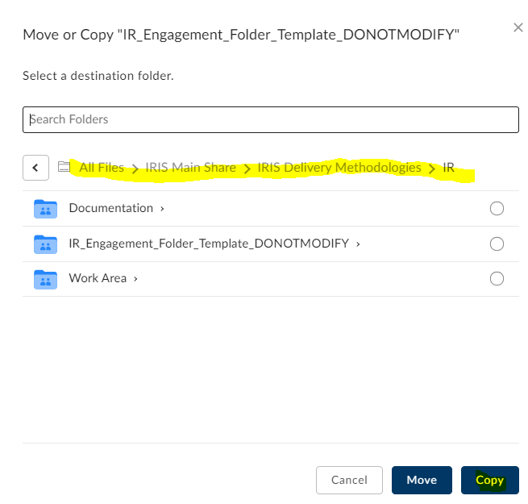

4. Navigate to a destination where folder was created, you may receive a green pop-up at the bottom of the page with option to show newly created folder.

5. Rename created folder according to requirements provided in the section <a href="#Environment-for-Data-Sharing-with-a-Client">Environment for Data Sharing with a Client</a>. 

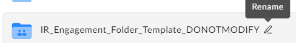

### IBM Box Folder for Digital Evidence
1.  Browse to the root of your IBM Box account:  [https://ibm.ent.box.com/folder/0](https://ibm.ent.box.com/folder/0)
2. On the right side chose "New" and then "Folder"

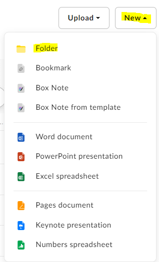

3. Enter folder name according to requirements provided in the section <a href="#Environment-for-Data-Sharing-with-a-Client">Environment for Data Sharing with a Client</a> and click "Create". Add XFIR team members working on this case with "Co-worker" permissions.

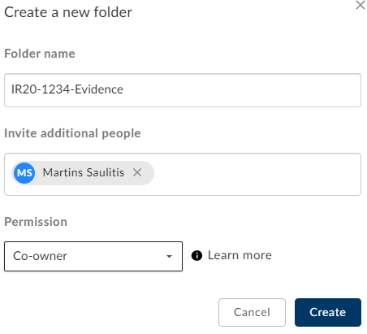

4. Navigate to newly created folder. 
5. Click "Share" on the right side to invite Client representatives

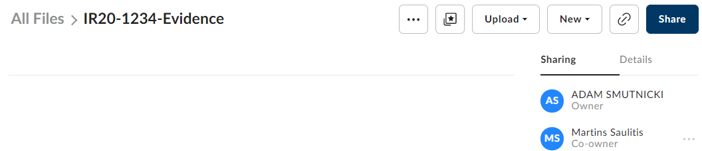

6. Enter Client email addresses so they receive invites (and need to create Box accounts). Make sure to assign "Previewer uploader" rights, to ensure tight control of uploaded data.

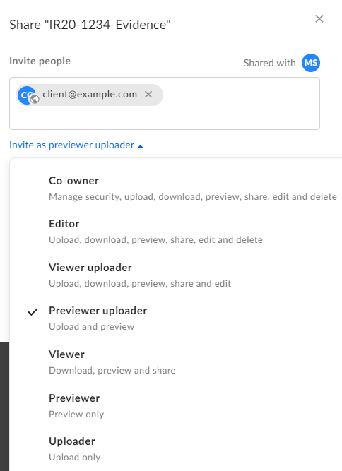

If your client has questions about data privacy and security as it relates to Box you can refer them to the official  <a href="https://cloud.app.box.com/s/igvy6orjgbhg8oxjn967s54x4py23st9">Box Security Whitepaper</a>. 

Make sure to do not send invites to free email provider accounts, such as Gmail, Hotmail, etc as they are banned from accessing IBM Box. It violates IBM ITCS300 Security Policy and you will receive tersely worded email.

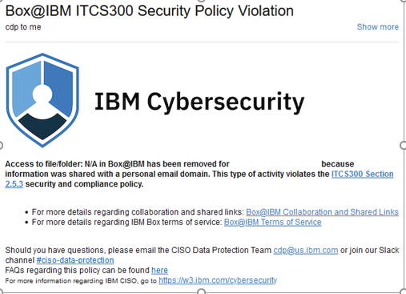

### Aspera
Location: https://ibm.ibmaspera.com/
#### Creating a Folder for an Aspera Upload
1. Launch Aspera in the browser and login with your IBM credentials.
2. Choose  "Files" application

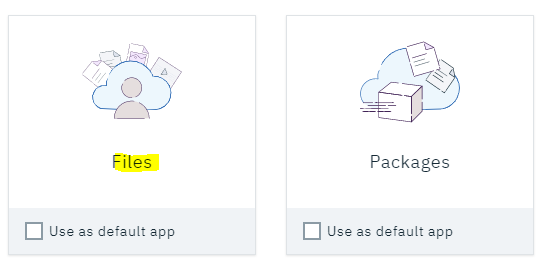

3. Ensure that you have "All IBM" chosen on left vertical menu.

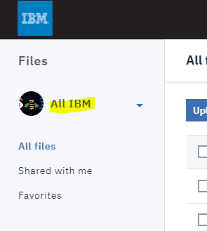

4. Click "Create folder"

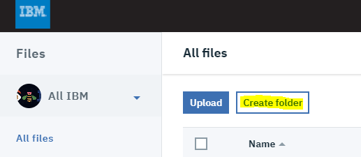

5. Enter folder name according to requirements provided in the section <a href="#Environment-for-Data-Sharing-with-a-Client">Environment for Data Sharing with a Client</a> and click "Create".

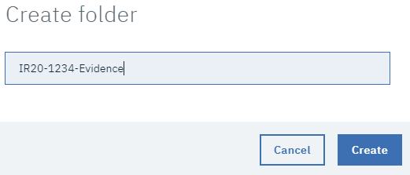

6. Navigate to newly created folder. 
7. Enter sharing options on the right side: click "Share this folder" and then "Invite collaborators"

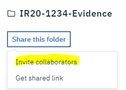

8. Invite XFIR team members working on this case with "Edit" rights.

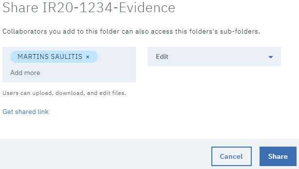

9. Invite Client representatives with "Custom" rights, assigning only following rights: "Browse", "Upload files" and "Create folders"

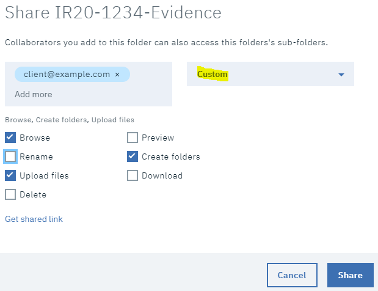

#### Troubleshooting Aspera
- Test Aspera connectivity: https://test-connect.asperasoft.com/. 
- Firewall configuration requirements documentation: https://www.ibm.com/support/pages/node/746389
- Aspera is able to use whole available bandwidth of the Internet connection so may disturb other traffic.

############################################################

## OLD

4.  Every IR engagement requires an  [Intel Engagement Ticket](https://github.ibm.com/XFIR/DFIR-wiki/blob/development/DFIR-SpinUp.md#intel-engagement-ticket). When we engage Intel for malware analysis, dark-web analysis, or any other Intel specific task related to an IR engagement, that work needs to be tracked and associated with an  `Engagement Work`  Intel ticket.

## Intel Engagement Ticket

All XFIR engagements of the type  `IR`  require an initial  `Engagement Work`  Intel ticket. Intel uses Jira for ticketing and associates additional tickets created in support of an engagement with this initial  `Engagement Work`  ticket. For example, if you submit three malware analysis tickets for your engagement, Intel will track the relationship between those tickets through the initial Intel ticket.

This makes the task of tracking those tickets easier for Intel and facilitates better workflow between IR consultants and Intel analysts working on an engagement together. XFIR uses functionality within Resilient to create and associate these tickets with our client engagements. For more information see the  [Intel Analysis Ticketing](https://github.ibm.com/XFIR/DFIR-wiki/wiki/XFIR-IR-IntelTicketing)  section.

