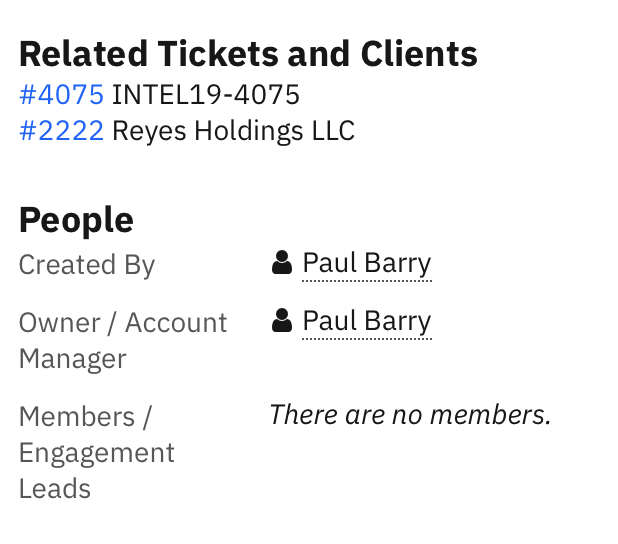
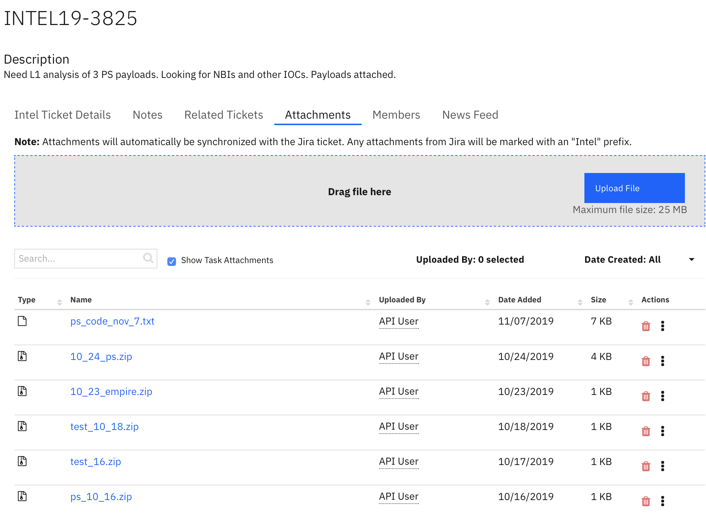

# XFIR Threat Intel for IR

## Table of Contents
1. [**Introduction**](#Introduction)
2. [**XFTI Contact Points**](#XFTI-Contact-Points)
3. [**Requesting TI Support for IR Engagements**](#Requesting-TI-Support-for-IR-Engagements)
4. [**Requesting RE Support for Malware Analysis**](#Requesting-RE-Support-for-Malware-Analysis)
	- [Definition of RE Analysis Levels](#Definition-of-RE-Analysis-Levels)
5. [**Self Service TI Tools for XFIR**](#Self-Service-TI-Tools-for-XFIR)
	- [Sherlock Slack channel](#Sherlock-Slack-Channel)
	- [Intl Bot App for Slack](#Intl-Bot-App-for-Slack)
	- [Sandbox](#Sandbox)
	- [Sherlock API](#Sherlock-API)
7. [**Requesting TI Support for Standalone Intel Engagements**](#Requesting-TI-Support-for-Standalone-Intel-Engagements)
8. [**Tutorials**](#Tutorials)
	- [Submitting Malware Sample to Sandbox](#Submitting-Malware-Sample-to-Sandbox)
	- [Creating Malware Analysis Ticket](#Creating-Malware-Analysis-Ticket)
	- [Creating Intel Engagement Ticket](#Creating-Intel-Engagement-Ticket)

## Introduction
The purpose of this page is to document how X-Force Threat Intelligence (XFTI) team supports XFIR engagements. There is number of services offered by XFTI supporting IR engagements directly or providing deliverable upon a Client request. In all those cases, XFIR represents IBM in front of the Client and is responsible for delivery. This page documents all aspects of interaction between XFTI and XFIR, as they differ depending on type of IR engagement. 

This is is a living document. If there is something you want to see documented here or explained with further detail please contact your geography Functional IR Lead (listed on the  [Homepage](Home.md)).

All XFIR engagements of the type  `IR`  require an associated `INTEL Ticket` with `Engagement Work`  type. This makes the task of tracking IR engagements easier for Intel Team and facilitates better workflow between IR consultants and Intel analysts working on an engagement together. This ticket is managed by XFTI team and XFIR team is only responsible to create it. During `IR` ticket creation, there is an option to create necessary "INTEL Ticket". `IR` ticket creation [guide](DFIR-Resilient.md#Logging-Requirements-for-New-IR-Engagements) for Resilient guides through this step as well. 

XFTI tracks their engagements using Jira ticketing system. It was integrated with XFIR Resilient instance, and provides two way synchronisation between them. XFIR team can request XFTI support and interact with XFTI team only using Resilient, without a need to access Jira.

## XFTI Contact Points
This section list named contact points which may be necessary during process of engaging XFTI.
| Intel Team | Manager | Backup|
|:--|:--|:--|
| Threat Hunt & Discovery | Chris Sperry | Robert Gates or Willie Gonzalez |
| Malware RE & Development | Anne Jobmann | Kevin Henson |

*Intel Threat Hunt & Discovery* team provides Intel about attribution, historical cases, IoC/TTP and correlate all details provided by IR and RE teams. 

## Requesting TI Support for IR Engagements
It is assume that "Intel Engagement" ticket was already created during creation of IR ticket. Shall this not be a case, make sure to create one following [this](#Creating-Intel-Engagement-Ticket) guide, continuing next steps from this section.

Proceed with below steps to engage XFTI for Incident Response case:
1. Engage XFTI Managers (list with names is [here](#Contact-Points)), who will assign necessary resources from their teams:
	- add *Intel Threat Hunt & Discovery* team Manager to an IR case Slack channel,
	- if RE support is needed, add *Malware RE & Development* team Manager to a case Slack channel.
2. Case Lead decides on information exchange models between IR and and *Intel Threat Hunt & Discovery* (so Intel analyst, but not RE team). Available approaches (default one should be proactive):
	- reactive
		- TI team responds to specific questions asked by IR team
		- IR team should define effort constraints (upper bound of how many hours can be charged)
		- most common use case: smaller cases or strict constraints on how hours are used
	- proactive
		- IR team dumps findings to a Slack channel
		- TI picks up those information in a proactive way (without being asked for it) and attempts to enrich them and add value 
		- most common use case: big complicated cases with a lot of findings; IR team being super busy and not able to administrate TI team work; cases with an "open bucket" for hours usage.
3. Post and pin a message in the Slack channel to define IR - TI workflow (or use a current "Administrative notes" pinned message in the channel, discussed in [guidelines](DFIR-SpinUp.md##Internal-XFIR-Working-Environment) for Internal working environment):
	- include statement: "IR - TI workflow: [reactive|proactive] (not applicable to RE requests)"
	- include Resilient Intel ticket number - Intel ticket number which was automatically created with IR ticket creation,
	- if there are any constraints on how many hours can be used for TI, including it in the message.
	- make sure it is define and posted upfront, not in the middle of the case when TI was already engaged.
4. If RE support is needed, proceed with steps described in section [Requesting RE Support for Malware Analysis](#Requesting-RE-Support-for-Malware-Analysis).

Below is the list of guidelines applicable to TI/RE requests and processing the results received from them. This is not a strict procedure, but following them should improve communication between IR and TI/RE, as well as provide better overall results:
- if working in reactive approach, make sure you clearly define the question and notify assigned TI/RE analyst on Slack channel about the question
- be clear on what do you expect as the outcome,
- be clear what is an expected response timeframe,
	- in case of a tight time limitations, be clear on what information, when and where you expect at the moment when time limitation is reached: eg. you have a call with a client at 15:00 UTC and you need any updated TI can provide on the current state, but you can not be left without no update from TI/RE team,
- provide feedback to TI/RE team so they know whether what was provided was indeed what you need:
	- always acknowledge receiving/reading/seeing findings,
	- if result is sufficient, make sure to inform TI/RE analyst about it so they are not working further on this topic,
	- if result does not meet your expectation make sure to clarify what do you need (eg. more details or you wanted something totally different),

Other important points:
- when TI is joined to a Slack channel they perform a quick Triage:
	- intention is to perform a quick attribution based on what IR team provides and thus help with remediation,
	- automatically done by assigned TI Analyst,
	- is not billed to a Client

## Requesting RE Support for Malware Analysis

**Before** creating any RE Resilient ticket and submitting a malware sample to RE team, **make sure** that:
- TI team is already engaged, proceeding with steps described in section [Requesting TI Support for IR Engagements](#Requesting-TI-Support-for-IR-Engagements) - it's obligatory to engage TI for any RE work.
- Sample has been already submitted for automated analysis to a Sandbox (also called L0 analysis), following guide described [below](#Submitting-Malware-Sample-to-Sandbox).
- A malware sample is packed into a password protected archive using the password "*infected*" for any non-automated analysis by RE Team (L1 and above). Using archives without a password often triggers various alerts and can cause sample removal, leading to a unnecessary delays in analysis.

Guidelines for engaging RE team:
- accommodate timezone difference to ensure efficient communications between IR and RE teams,
- make sure to clearly express your expectation in the RE ticket apart from only picking up analysis type - explain in details what you need, eg.:
	- is it for IR consumption only or customer facing report,
	- do you need formal report or just ticket updates are sufficient,
	- do you need updates during a process, if so clearly define a timeframe, eg. everyday at 12 UTC there is a call with a client and you need an note with update on finding and progress left on Slack channel before that call.
- For malware critical situations - add EU or AU resource for immediate work start and Anne for visibility into Slack channel.
- technical tutorial on how to submit RE analysis Ticket in Resilient is available [below](#Creating-Malware-Analysis-Ticket).

### Definition of RE Analysis Levels
 **Level 0** - Automated sandbox run
 For people who don't have access to the sandbox or just want runs with no context. Output is a link to sandbox run or other output from tools in the JIRA ticket.

**Level 1** - Quick Triage Report
Leverage automation and dynamic analysis to pull out tactical information to support an investigation or extract indicators without an in-depth explanation. Tactical indicators returned in the JIRA ticket or in a report only if requested.  This should be a first step output for any IR engagement request.

**Level 2** - Full Malware Report
Identify and explain the relevance of indicators, characteristics, commands and behaviors of the malware in the requested time-frame. Provide as much context as possible in the JIRA ticket to direct or guide the analysis.  Examples of relevant context includes where the file was found or it's interactions with other potential files on the compromised system, other samples or tickets that might be related, suspected identification and any relevant open source reporting or information.  If a specific malware feature such as C2 commands, encryption details or network communications should be the primary focus, that should be indicated in the request as well. Resource intensive, primarily utilized to support a paying customer.

**Level 3** - Targeted Capability Creation and Full Malware Report
Create signatures, parser, decoders as requested or as relevant to support automation efforts around processing the malware. Provide as much context as possible in the JIRA ticket to direct or guide the analysis.  Suspected identification and any relevant open source reporting or information should be provided.  If a specific malware feature such as C2 commands, encryption details or network communications should be the primary focus, that should be indicated in the request as well. This can be very resource intensive.

**Level 4** - Focused Effort
Answer a specific question or set of questions about a particular piece of malware or provided sample.  This report type should is best used to create/fix/update a targeted script or capability or as a follow-on to a previous effort to answer a discrete set of questions.  A full analysis report may or may not be necessary depending on the circumstances.  This ticket type can be used for a follow on request to previous analysis. This request can be used to support an external investigation, automation efforts, or hunting and research. Provide as much context as possible in the JIRA ticket for the specific request.  If a grouping of samples is submitted for targeted capability development provide any relevant open source reporting or possible categorizations (dropper, loader, trojan etc...) along with the requested capability (YARA signature, configuration parser etc...).  Additional examples of requests might be to: update a script to decrypt additional variants, provide details of a specific malware feature such as C2 commands, encryption details or network communications, or confirm it is the same as this open-source malware and if not conduct full L2 analysis. Resource level varies.

## Self Service TI Tools for XFIR
XFTI team offers several tools which can be used by XFIR to self service and obtain Intel and RE related information without waiting for peoples' availability or timezone difference. 

### Sherlock Slack Channel
2DO

### Intl Bot App for Slack
2DO

### Sandbox
2DO

### Sherlock API
2DO

## Requesting TI Support for Standalone Intel Engagements
2DO: requests from the scope of the IR, but without XFIR being engaged, so we are just a proxy. 
A separate threat for a discussion with Chris S is driven by Davide from EU. To be discussed whether we need this section.

## Tutorials

### Submitting Malware Sample to Sandbox
2DO

### Creating Malware Analysis Ticket
Proceed with following steps to submit a ticket to RE Team:
1. Click the `Create` button at the top of the main Resilient page.
2. In the `Ticket Type` field select `INTEL Ticket`.
3. In the `Region` field select the appropriate region that correlates with the client's region.
4. In the `Type of Intel Support` field select `Malware Analysis`. In the `Related Resilient Engagement` field enter the Resilient Ticket ID for your IR engagement (`IR19-3818` for example).
5. Enter a brief but detailed description in the `Description` field.
6. In the `Work ID` field input the ILC bill code for your project
7. Select the analysis level in the `(Intel) Level of Malware Analysis` field and provide any additional details you have for the sample (MD5, Sandbox URL, Maximum number of hours to consume, Due Date, and Engagement Box URL). Levels of Malware Analysis are explained in separate [section](#Definition-of-RE-Analysis-Levels).
8. Enter random text into "Name" field, it is required however, will be discarded and automatically populated by Resilient.
9. Click `Next` and your Intel Malware Analysis ticket will be created. At this point you have created the ticket for analysis however, you will still need to attach the malware sample(s) to the ticket.

Example screenshoot of filled in ticket:

If you return to the main Resilient Engagement Ticket that you created the Malware Analysis ticket in support of, you will see the new ticket in the `Related Tickets and Clients` section of the Engagement Ticket. 

Select your newly created Intel ticket and add sample(s) on the `Attachements` tab.

If you need to add additional samples at a later time, you can always add additional attachments to this tab and the corresponding Jira ticket will be updated. This also works for the `Notes` tab. If you need to provide additional details surrounding the malware you can create a note in the `Notes` tab and that information will be updated on the Intel Jira ticket.

### Creating Intel Engagement Ticket
**IMPORTANT**: This section only applies to the situation when IR ticket was created without associated Intel ticket. If you followed guides from this wiki, you should not need to proceed with below steps as Intel ticket should have been already created.

In the case where an IR engagement ticket has already been created or you need to update an existing Hotline Triage ticket to include the `IR` tag when a client engages us, use the following instructions for creating an associated Intel ticket.

1. Click the `Create` button at the top of the main Resilient page.

2. In the `Ticket Type` field select `INTEL Ticket`.

3. In the `Region` field select the appropriate region that correlates with the client's region.

4. In the `Type of Intel Support` field select the appropriate Intel ticket type.

Currently the options are:

 - Engagement Work - Request an INTEL resource for IRs, FORs, ATAs, Dark Web Analysis, etc.
- Malware Analysis - Submit a malware analysis request.
- Production Work - Request for a STA

If this is the first Intel ticket that will be associated with your IR engagement choose the `Engagement Work` Intel ticket type. This is highly recommended to help Intel keep track of associated tickets. Even in the case where all you need is malware analysis, or dark web analysis, it helps Intel keep track of tickets on their end if there is a "Master" ticket for each engagement that they can then associate additional tickets with.

5. In the `Related Resilient Engagement` field type the Resilient ticket ID for your IR engagement. (`IR19-3818` for example). And provide a brief but detailed description in the `Description` field.

6. In the `(Intel) Type of Engagement` field select `IR - Incident Response` as this documentation is for the IR Intel ticketing process and you are creating an initial `Engagement Work` ticket for your IR engagement.

Fill out the `Client` detail field and provide a more detailed description in the `(Intel) Description` field. This description needs to include the specific ask(s) from Intel. Why are we requesting support and what are the details of the IR so that Intel can assign the appropriate resource.

Finally, fill out the `(Intel) Engagement Data URL` with the URL for the Engagement Box folder.

Repeat this process if there is already an engagement work ticket for your IR (All engagements of the type `IR` are required to have an Intel `Engagement Work` ticket) and you need to create a ticket for malware analysis, dark web analysis, etc. On the backend in Jira, Intel will be able to correlate those additional requests for their tracking purposes.
