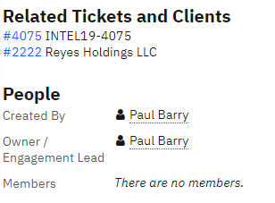
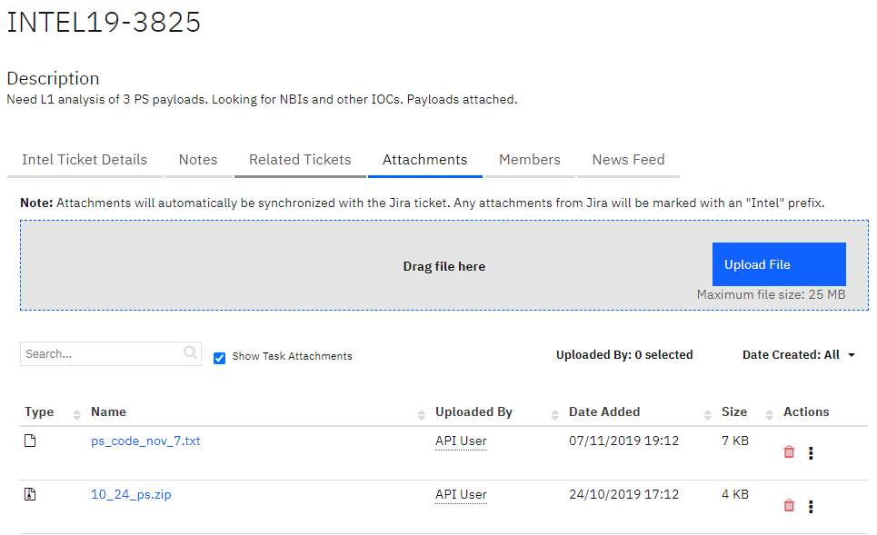
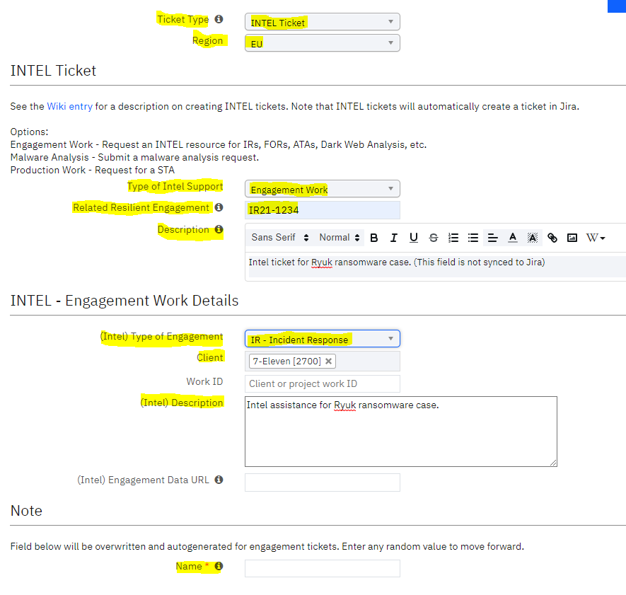

# Threat Intel for DFIR engagements

## Table of Contents
1. [**Introduction**](#Introduction)
2. [**XFTI Contact Points**](#XFTI-Contact-Points)
3. [**Requesting TI Support for IR Engagements**](#Requesting-TI-Support-for-IR-Engagements)
4. [**Requesting RE Support for Malware Analysis**](#Requesting-RE-Support-for-Malware-Analysis)
	- [Definition of RE Analysis Levels](#Definition-of-RE-Analysis-Levels)
5. [**Self Service TI Tools for XFIR**](#Self-Service-TI-Tools-for-XFIR)
	- [Intel Bot Slack Channel](#Intel-Bot-Slack-Channel)
	- [Intel Bot App for Slack](#Intel-Bot-App-for-Slack)
	- [Direct Sherlock Access](#Direct-Sherlock-Access)
	- [Sandbox](#Sandbox)
	- [Intel Yara Rules](#IntelYara-Rules)
6. [**Requesting TI Support for Standalone Intel Engagements**](#Requesting-TI-Support-for-Standalone-Intel-Engagements)
7. [**Additional XFTI Resources**](#Additional-XFTI-Resources)
8. [**Tutorials**](#Tutorials)
	- [Creating Malware Analysis Ticket](#Creating-Malware-Analysis-Ticket)
	- [Creating Intel Engagement Ticket](#Creating-Intel-Engagement-Ticket)

## Introduction
The purpose of this page is to document how X-Force Threat Intelligence (XFTI) team supports DFIR engagements run by XFIR. Process and rules for interaction, described on this page are only applicable to services performed by XFTI as a part of IR engagements (eg. Malware analysis, attribution, IoC/TTP enrichment). Any other type of service or deliverables offered by XFTI to XFIR Clients (eg. STA, Dark Web Search) should follow a [separate process](NOT_YET_AVAILABLE).

This is is a living document. If there is something you want to see documented here or explained with further detail please contact your geography Functional IR Lead (listed on the  [Homepage](Home.md)).

All XFIR engagements of the type  `IR`  require an associated `INTEL Ticket` with `Engagement Work`  type. It is used to make the task of tracking IR engagements easier for Intel Team as well as facilitates better workflow between IR consultants and Intel analysts working on an engagement together. This ticket is managed by XFTI team and XFIR team is only responsible to create it. During `IR` ticket creation in Resilient, there is an option to create necessary "INTEL Ticket". IR ticket creation [guide](DFIR-Resilient.md#Logging-Requirements-for-New-IR-Engagements) for Resilient includes through this step as well. 

XFTI tracks their engagements using Jira ticketing system. It was integrated with XFIR Resilient instance and provides two way synchronisation between them. XFIR team can request XFTI support and interact with XFTI team only using Resilient, without a need to access Jira.

## XFTI Contact Points
This section list named contact points which may be necessary during process of engaging XFTI.
| Intel Team | Manager | Backup|
|:--|:--|:--|
| Threat Hunt & Discovery | Chris Sperry | Robert Gates or Willie Gonzalez |
| Malware RE & Development | Anne Jobmann | Kevin Henson |

*Intel Threat Hunt & Discovery* team provides information related to attribution, historical cases, IoC/TTP and correlate all details provided by IR and RE teams. 

## Requesting TI Support for IR Engagements
It is assumed that `Intel Engagement` ticket was already created during creation of `IR` ticket. Shall this not be a case, make sure to create one following separate [guide](#Creating-Intel-Engagement-Ticket), **before** proceeding with steps documented in this section.

Proceed with below steps to engage XFTI for Incident Response case:
1. Engage XFTI Managers (list with names is [here](#XFTI-Contact-Points)), who will assign necessary resources from their teams:
	- add *Intel Threat Hunt & Discovery* team Manager to an IR case Slack channel,
	- if RE support is needed, add *Malware RE & Development* team Manager to a case Slack channel.
2. Case Lead decides on information exchange models between IR and TI analyst from *Intel Threat Hunt & Discovery* team. Available approaches are:
	- proactive:
		- should be treated as default, unless there are some constraints,
		- IR team provides their findings to a Slack channel,
		- TI picks up those information in a proactive way (without being asked for it) and attempts to enrich them,
		- most common use case:
			- big complicated cases with a lot of findings; IR team being very busy and not able to administrate TI team work,
			- cases with an "open bucket" for hours usage.
	- reactive:
		- TI team responds to specific questions asked by IR team,
		- IR team should define effort constraints (upper bound of how many hours can be charged),
		- most common use case: smaller cases or strict constraints on how hours are used.
3. Post and pin a message in the Slack channel to define IR - TI workflow (or use a current "Administrative notes" pinned message in the channel, discussed in [guidelines](DFIR-SpinUp.md##Internal-XFIR-Working-Environment) for Internal working environment):
	- include statement: "IR - TI workflow: [reactive|proactive] (not applicable to RE requests)"
	- include Resilient Intel ticket number - Intel ticket number which was automatically created with IR ticket creation,
	- if there are any constraints on how many hours can be used for TI, including it in the message,
	- make sure it is defined and posted upfront, not in the middle of the case when TI was already engaged.
4. If RE support is needed, proceed with steps described in section [Requesting RE Support for Malware Analysis](#Requesting-RE-Support-for-Malware-Analysis).

Please follow below guidelines while engaging TI/RE teams. This is not a strict procedure, but following them should improve communication between IR and TI/RE, as well as provide better overall results:
- if working in reactive approach, make sure you clearly define the questions/requests and notify assigned TI/RE analyst on Slack channel that you have posted them,
- be crystal clear on what do you expect as the outcome,
- be clear what is an expected response timeframe,
	- in case of a tight time limitations, clearly express expectations: what kind of information, when and where should be provided by TI/RE analyst: eg. you have a call with a client at 15:00 UTC and you need any updated TI can provide on the current state, but under no circumstances you can not be left without any status update from TI/RE team,
- provide feedback to TI/RE team so they know whether the information or deliverable provided was indeed what you need:
	- always acknowledge receiving/reading/seeing findings,
	- if the result is sufficient, make sure to inform TI/RE analyst about it so they are not working further on this topic,
	- if the result does not meet your expectation make sure to clarify what do you need (eg. more details or you wanted something totally different).

Other important points:
- when TI is joined to a Slack channel they perform a quick Triage:
	- the goal of the XFTI triage is to perform a quick attribution based on what IR team provides and thus help with remediation,
	- XFTI triage is automatically performed by assigned TI Analyst and XFIR do not need to request for it,
	- XFTI triage time is not billed to a Client.
- If you believe that cooperation between XFIR and XFTI teams is not working in your case, reach out to XFTI managers to address any problems (contacts listed [above](#XFTI-Contact-Points)).

## Requesting RE Support for Malware Analysis
**Before** creating any RE Resilient ticket and submitting a malware sample to RE team, **make sure** that:
- TI team is already engaged, proceeding with steps described in section [Requesting TI Support for IR Engagements](#Requesting-TI-Support-for-IR-Engagements) - it's obligatory to engage TI for any RE work. Also, make sure to follow all guidelines from that section.
- Malware sample has been already submitted for automated analysis to a Sandbox (also called L0 analysis), following guide described [below](#Sandbox).
- A malware sample is packed into a password protected archive using the password "*infected*" for any non-automated analysis by RE Team (L1 and above). Using archives without a password often triggers various alerts and can cause sample removal, leading to a unnecessary delays in analysis.

Please follow below guidelines while engaging RE team:
- accommodate timezone difference to ensure efficient communications between IR and RE teams,
- make sure to clearly express your expectation in the RE ticket apart from only picking up analysis type - explain in details what you need, eg.:
	- whether the result would be consumed only by XFIR or by Client as well,
	- do you require a formal report or whether updating the ticket notes is sufficient,
	- do you need updates during a process, if so clearly define a timeframe, eg. everyday at 12 UTC there is a call with a client and you need an note with update on finding and progress left on Slack channel before that call.
- for malware critical situations - add EU or AU resource for immediate work start and Anne for visibility into Slack channel.
	- APAC RE Contacts – Reginald Wong, Christopher (Topet) Del Fierro,
	- EMEA RE Contact – Charlotte Hammond,
- technical tutorial on how to submit RE analysis Ticket in Resilient is available [below](#Creating-Malware-Analysis-Ticket).

### Definition of RE Analysis Levels
 **Level 0** - Automated sandbox run
Normally, you should proceed with [Sandbox self service](#Sandbox) approach described below. This is a legacy option, left for people who don't have access to the sandbox or just want runs with no context. Output is a link to sandbox run or other output from tools in the JIRA ticket. 

**Level 1** - Quick Triage Report
Leverage automation and dynamic analysis to pull out tactical information to support an investigation or extract indicators without an in-depth explanation. Tactical indicators returned in the ticket or in a report only if requested.  This should be a first step output for any IR engagement request.

**Level 2** - Full Malware Report
Identify and explain the relevance of indicators, characteristics, commands and behaviors of the malware in the requested time-frame. Provide as much context as possible in the ticket to direct or guide the analysis.  Examples of relevant context includes where the file was found or it's interactions with other potential files on the compromised system, other samples or tickets that might be related, suspected identification and any relevant open source reporting or information.  If a specific malware feature such as C2 commands, encryption details or network communications should be the primary focus, that should be indicated in the request as well. Resource intensive, primarily utilized to support a paying customer.

**Level 3** - Targeted Capability Creation and Full Malware Report
Create signatures, parser, decoders as requested or as relevant to support automation efforts around processing the malware. Provide as much context as possible in the ticket to direct or guide the analysis.  Suspected identification and any relevant open source reporting or information should be provided.  If a specific malware feature such as C2 commands, encryption details or network communications should be the primary focus, that should be indicated in the request as well. This can be very resource intensive.

**Level 4** - Focused Effort
Answer a specific question or set of questions about a particular piece of malware or provided sample.  This report type should is best used to create/fix/update a targeted script or capability or as a follow-on to a previous effort to answer a discrete set of questions.  A full analysis report may or may not be necessary depending on the circumstances.  This ticket type can be used for a follow on request to previous analysis. This request can be used to support an external investigation, automation efforts, or hunting and research. Provide as much context as possible in the ticket for the specific request.  If a grouping of samples is submitted for targeted capability development provide any relevant open source reporting or possible categorizations (dropper, loader, trojan etc...) along with the requested capability (YARA signature, configuration parser etc...).  Additional examples of requests might be to: update a script to decrypt additional variants, provide details of a specific malware feature such as C2 commands, encryption details or network communications, or confirm it is the same as this open-source malware and if not conduct full L2 analysis. Resource level varies.

## Self Service TI Tools for XFIR
XFTI team offers several tools which can be used by XFIR to self service and obtain Intel and RE related information without delays caused by unavailability of TI/RE teams or timezone difference. 

Threat Intel information are modelled in Sherlock Database. This section contains reference on different methods on how to access data from Sherlock. Additional section deals with Sandbox usage for malware samples analysis. 

### Intel Bot Slack Channel
Intel team created a dedicated channel, where one can query Sherlock database using dedicated Intel Bot. Join channel `iris-intel_bot` located in `ibm-security.slack.com` Slack workspace. 

Enter command `/intel-help` to display usage information.

### Intel Bot App for Slack
Having TI source outside a Slack channel dedicated for IR engagement is inconvenient. For this reason, it is recommended to add Intel Bot App to a case Slack channel, receiving ability to ask Intel Bot the same commands as in the `iris-intel_bot` channel. Add `sherlock2-for-iris` app in the same way as any other person is added to a channel using `@` operator.

### Direct Sherlock Access
There are several options:
1. Access Sherlock UI:
	- https://www.intsum.ibm.com/myintel/login
	- Reach out to Chris Sperry to be added to a group of people with access.
2. Sherlock Bulk Search Webpage:
	- http://sherlock-search.mybluemix.net/bulk-search
3. Bulk search python script with read-only access:
	- script is currently in the development phase,
	- if you need to use it, reach out to Megan Roddie for guidance

### Sandbox
Currently, as temporary solution we have 2 Sandboxes available for self service:
1. Lastline:
	- [https://user.lastline.com/portal#/analyst/file](https://user.lastline.com/portal#/analyst/file)
	- To request an account, managers or leads should create a JIRA Ticket Request for “Access Request” for Lastline.
	- if JIRA is not accessible, email anne.jobmann@ibm.com or sarah.gomez-uscategui@ibm.com to request access
	- Script to submit a file to Lastline, retrieve a report and delete the file from Lastline’s cloud: https://github.ibm.com/X-Force-IRIS-Intel/OSINT-Tools-Scripts/tree/master/lastline
2. SecondWrite:
	- Request SecondWrite accounts at https://webportal.secondwrite.com
		- register as a new User (Sign up Now) with your IBM email account
		- in the field `Reason for signup` add "IBM X-Force"
	- If upon login you don't see a "Enterprise" license (or anything else clearly indicating account with sufficient quota) reach out to Anne Jobmann, so she can request adding you to a correct group.

#### IMPE (not yet available)
This is a destination platform, with potential beta testing starting in 2021Q2. IMPE is a central platform providing access to multiple Sandboxes. Introduction of IMPE should remove a need to obtain access to every Sandbox separately. Access to IMPE is granted with a JIRA Ticket Request for "Access Request" for IMPE access. It accepts password protected samples

### Intel Yara Rules
TI and RE teams maintain a repository containing all of their YARA rules:
https://github.ibm.com/X-Force-IRIS-Intel/YARA-Signatures/

## Requesting TI Support for Standalone Intel Engagements

This section should address requests for Intel Engagements which fall outside scope of supporting IR engagement. In such a cases XFIR becomes a proxy for Intel based deliverable. 
Currently a separate discussion is ongoing and led by Chris Sperry and Davide Paltrinieri from XFIR EU. 

## Additional XFTI Resources
 - Main IRIS Publisher Page - https://w3.ibm.com/w3publisher/x-force-iris 
 - Intel Offerings - https://w3.ibm.com/w3publisher/x-force-iris/offerings Intel
 - Enablement Material - https://w3.ibm.com/w3publisher/x-force-iris/enablement Intel
 - Sherlock/IMPE Information - https://w3.ibm.com/w3publisher/x-force-iris/enablement/find-evil
 - Sherlock UI - https://www.intsum.ibm.com/myintel/login
 - Trustar -https://station.trustar.co/ 
 - IRIS Intel Tools - https://github.ibm.com/X-Force-IRIS-Intel/
 - IRIS Threat Groups - https://ibm.biz/threatgroups
 - IRIS Research Hub - https://www.ibm.com/security/xforce/research-hu

## Tutorials

### Creating Malware Analysis Ticket
Proceed with following steps to submit a ticket to RE Team:
1. Click the `Create` button at the top of the main Resilient page.
2. In the `Ticket Type` field select `INTEL Ticket`.
3. In the `Region` field, select the appropriate region that correlates with the client's location.
4. In the `Type of Intel Support` field select `Malware Analysis`. 
5. In the `Related Resilient Engagement` field enter the Resilient Ticket ID for your IR engagement (`IR21-1234` for example).
6. Enter a brief but detailed description in the `Description` field. This field is not synced to Jira, thus not visible to RE team.
7. In the `Work ID` field input the ILC bill code for your project.
8. Select the analysis level in the `(Intel) Level of Malware Analysis` field and provide any additional details you have for the sample (MD5, Sandbox URL, Maximum number of hours to consume, Due Date, and Engagement Box URL). Levels of Malware Analysis are explained in separate [section](#Definition-of-RE-Analysis-Levels).
9. Make sure you populate `(Intel) Description` - this is the only description field synced to Intel Jira. Make sure to add any additional context of the sample, specific requirements, eg. reporting, update timeframe, etc.
10. Enter random text into `Name` field, it is required however, will be discarded and automatically populated by Resilient.
11. Click `Next` and your Intel Malware Analysis ticket will be created. At this point you have created the ticket for analysis however, you will still need to attach the malware sample(s) to the ticket.

Example screenshot of a populated ticket:

If you return to the main IR Resilient ticket that you created the Malware Analysis ticket in support of, you will see the new ticket in the `Related Tickets and Clients` section on the right: 

Select your newly created Intel ticket and add sample(s) on the `Attachements` tab:

If you need to add additional samples at a later time, you can always add additional attachments to this tab and the corresponding Jira ticket will be updated. This also works for the `Notes` tab. If you need to provide additional details surrounding the malware you can create a note in the `Notes` tab and that information will be updated on the Intel Jira ticket.

### Creating Intel Engagement Ticket
**IMPORTANT**: This section only applies to the situation when IR ticket was created without associated Intel ticket. If you have followed guides from this wiki, you there should not be a need to proceed with below steps as Intel ticket should have been already created.

1. Click the `Create` button at the top of the main Resilient page.
2. In the `Ticket Type` field select `INTEL Ticket`.
3. In the `Region` field select the appropriate region that correlates with the client's location.
4. In the `Type of Intel Support` field select `Engagement Work`.
5. In the `Related Resilient Engagement` field enter the Resilient Ticket ID for your IR engagement (`IR21-1234` for example).
6. Enter a brief but detailed description in the `Description` field. This field is not synced to Jira, thus not visible to TI team.
7. In the `(Intel) Type of Engagement` field select `IR - Incident Response`.
8. Populate `Client` field with correct value.
9. In the `Work ID` field input the ILC bill code for your project.
10. Make sure you populate `(Intel) Description` - this is the only description field synced to Intel Jira. Make sure to add any additional context of the sample, specific requirements, eg. reporting, update timeframe, etc.
11. Enter random text into `Name` field, it is required however, will be discarded and automatically populated by Resilient.
12. Click `Next` and your Intel Engagement ticket will be created.

Example screenshot of a populated ticket:

