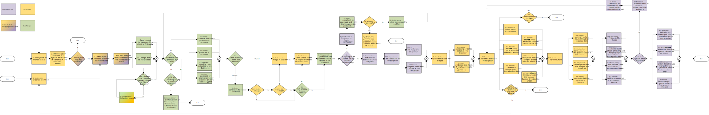
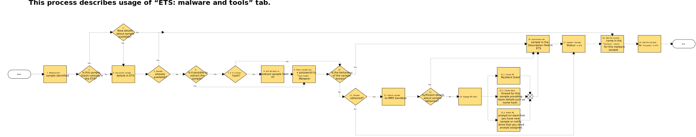

## Table of Contents
1. [**Introduction**](#Introduction)
2. [**Document Templates**](#Document-Templates)
3. [**ETS Design**](#ETS-Design)
4. [**Systems of Interest and Evidence Tabs**](#Systems-of-Interest-and-Evidence-Tabs)
5. [**Malware and Tools Tab**](#Malware-and-Tools-Tab)
6. [**IoCs Tab**](#IoCs-Tab)
7. [**Timeline Tab**](#Timeline-Tab)
8. [**Individual System Investigation Sheet**](#Individual-System-Investigation-Sheet)

## Introduction
The purpose of this page is to document usage of Engagement Tracking Sheet (ETS) as a primary point where all information related to DFIR investigation are collected. This is is a living document. If there is something you want to see documented here or explained with further detail please contact your geographic Functional IR Lead (listed on the  [Homepage](Home)).

**IMPORTANT:** This page contains documentation for the new development version of ETS - make sure you read it carefully. Despite some initial testing performed on real incidents, this ETS template and associated workflows may contains bugs or use concepts which may not work optimally. This page is still in the DRAFT stage, please use with caution. 

Any feedback on development version of ETS should be provided to Adam Smutnicki.

Some of the main goals behind ETS are:
- Create a **single, up-to-date and reliable** source of information for team running a IR case and feeding finding to Client and other stakeholders.
- Define and implement efficient case management workflow, properly tracking all information recorded in ETS, so less time is wasted on "handling case management chaos".
- Define **unified workflow**, so everyone working on the case have a same understanding on what information and how are feed into ETS, as well as have common interpretation. 
- Ensure that all collected information are recorded in ETS.
- Provide some basic level of automation, to again waste less time.
- Define basic level of common terminology for case management.
- Remove pain points of previous case management solutions.
- Build single tracker allowing multiple people to work in parallel, using Excel Online.

## Document Templates
### New Development Version (only EMEA for testing)
- [ETS](https://github.ibm.com/XFIR/DFIR-wiki/blob/master/documents/ETS/IBM%20X-Force%20IR%20Engagement%20Tracking%20Sheet%20IRXX-ABCD%20new%20v0.4.5.xlsx)
- [System Analysis and Timeline](https://github.ibm.com/XFIR/DFIR-wiki/blob/master/documents/ETS/IBM%20X-Force%20IR%20System%20Analysis%20Tracking%20Sheet%20IRXX-ABCD%20HOSTNAME%20v0.1.xlsx)
### Legacy Version
- [ETS](https://github.ibm.com/XFIR/DFIR-wiki/blob/master/documents/ETS/IBM%20X-Force%20IR%20Engagement%20Tracking%20Sheet%20IRXX-ABCD.xlsx)
- [System Analysis and Timeline](https://github.ibm.com/XFIR/DFIR-wiki/blob/master/documents/ETS/IBM%20X-Force%20IR%20System%20Analysis%20Tracking%20Sheet.xlsx)

## ETS Design
The ETS is a single spreadsheet to track all components of the IR engagement. It goes beyond just forensics findings, which includes project management, remediation and monitoring. ETS as an Excel Spreadsheet, containing several tabs which define how certain data should be captured:
- Case Summary - basic information about the case, including list of people working on a case.
- Case Statistics - several tables automatically populated with most common statistics derived from investigation data, which can be simply copied to daily status reporting to document progress.
- Request Tracker - track requests between Client to XFIR.
- Evidence - track all evidence items, such as host based or external log sources.
- Systems of Interest - track all hosts which appeared during investigation - not only documenting compromised hosts, but also to document systems which were checked for other reasons - avoid duplicating work (eg. internal IP was identified and entered into this tab to explain what kind of device it is).
- Timeline - overall timeline a whole incident, built based on events marked as notable from individual systems.
- Compromised Accounts - list most important details about compromised accounts identified during investigation.
- IoCs - list of IoCs used during investigation, excluding malware and tools as those are tracked separately.
- Malware and Tools - list of malware samples and tools (including legitimate ones) found during investigation, as well as their key details.
- Keywords - common list of searched keywords which can be share between analysts.
- Remediation - track remediation activities performed as a part of Remediation Stream.
- Data Theft - track evidence of data exfiltration.
- ATT&CK related tabs - ATT&CK values for dropdown lists in Timeline tab, for investigation requiring such values.
- Dropdown Lists Values - tab used to define drop down lists, which can be amended on the engagement level if needed.

### Notable design concepts of ETS:
- Systems of interest are separated from evidence items:
	- There may be multiple evidence per single system or they may be a system we want to document, but which is not investigated.
	- The relation between system of interest and evidence is 1:N.
	- Detailed workflow is provided below, to explain how data should be entered.
- Basic audit of data origin:
	- Most of tabs contain 2 columns "Added By" and "Date Added" which must be populated for each record.
- Unify case management data which are entered by multiple people:
	- Wherever possible, drop down lists are used, including names of consultants working on the case.
	- Names of consultants working on the case need to be added on "Case Summary" tab, so they appear as drop down values.
	- Forensics findings unification is another project, so does not apply to this point.
- Comprehensive data collection:
	- All fields defined for each record **must** be filed in. 
	- Fields defined for each records have been reviewed and decided that this is a level of information we want to collect - they are **no longer optional**.
	- There may be specific cases when particular column can't be filled in, but this should be an exception.
- Manage malware and tools related findings, as they are not simple IoCs:
	- Separate malware and tool details from other IoC's to capture more details about programs/scripts used by attacker.

### Data Validation
ETS Template contains some basic data validation, to improve the quality of data we capture:
- Some fields will be marked in red, to indicate that either data is missing or incorrect and should be immediately updated.
- Validation rule allows "Date Added" to only have value of "today" assuming today is when you enter the record data:
	- The aim is to ensure we are building a timeline of when new data were added to ETS, eg. for reporting new findings to client.
	- "Date Added" must by always set to today, as when you enter data, not a day when you have found it (eg. yesterday) but forgotten to populate.
	- Do **not timestomp** data to previous days even if you have forgotten to add it, as you may break spreadsheet consistency and Client reporting - it's better to report something with a delay, than do not report assuming it was reported in previous cycles (due to timestomping).

### Hacking
If you want to add data which are not available through drop down lists, there are 2 options:
1. If you need to add additional options for a drop down list, go to "Dropdown Lists Values" tab and find drop down list values you need to modify. Then insert a new line **above** last value and add your new value (do not add below last value as the ranges for drop down lists may not pick it up).
2. If you need to add value just one time, enter it to another cell and copy paste to the cell with drop down list. 


## Systems of Interest and Evidence Tabs
The main goal of this workflow is to build **reliable** and **up-to-date** list of systems of interest and track evidence items. Below diagram explains the workflow for managing systems of interests and evidence (additional high resolution [PDF version](https://github.ibm.com/XFIR/DFIR-wiki/blob/master/documents/ETS/XFIR_ETS_workflow-systems_of_interest_and_evidence.pdf) of the diagram). Roles used on the diagram are defined on [Case Management](Case-Management#Roles-and-Responsibilities) wiki page.


Explanation for some of the steps:
- 8. Provide Evidence Collection Manuals
	- Use manuals (aka one pagers) available on [Digital Evidence](Digital-Evidence#Remote-Evidence-Collection-Manuals) page.
- 12.2 Populate Received Date in ETS: Evidence
	- This is a date when XFIR received evidence, eg. it was uploaded to cloud storage or physically shipped to lab or consultant's location.
- 12.3 Obtain and populate "When collected" in ETS: Evidence
	- This is a date when evidence item was collected, not delivered or uploaded, to explain a snapshot of what moment it time this evidence item represents.
	- For disk image, this would be date when image was created.
	- For backups this would be date of the backup creation.
- 18. Is it already in "Evidence Folder"?
	- "Evidence folder" in this context is defined [here](Case-Management#Handling-Digital-Evidence-Client-Data-and-Case-Data).
- 33.3 Document notable findings within Slack thread per evidence item
	- Follow detailed guidance on documenting findings on Slack on [Case Management](Case-Management#Documenting-Findings-on-Slack) wiki page.
- 33.5. Extract and Analyse all Malware samples or tools used by Threat Actor
	- Follow detailed process on handling malware and tools documented [below](#Malware-and-Tools-Tab).
- 33.6. Document analysis in “Individual System Investigation Sheet”
- 33.7. Mark notable timeline events in the “Individual System Investigation Sheet”
	- Follow guidelines documented in [below section](#Individual-System-Timeline-Tab) on how to tag events as notable.
- 35.1. Populate summary note in Slack thread for evidence item
	- Update "Investigation Status Note" within Slack Thread.
- 40.2. Merge notable events of individual system timeline to “ETS: timeline”
	- When approved by Investigation Lead, notable events from Individual System Investigation Sheet are moved to a master timeline in ETS.

Additional guidelines on using Systems or Interest and Evidence tabs:
- Every host-based Evidence item (eg. disk image, triage package, memory dump) must have a corresponding System of Interest entry.
- Non host-based evidence items (eg. log exports from network devices representing multiple devices) should be only added to Evidence tab - there is no need to create *artificial* system of interest entry for such log.
- Earliest Evidence of Compromise - enter the earliest confirmed date when malicious activity happened.
- Data Location - should clearly indicate where data is located in, ideally should be URL to a Evidence Folder containing this evidence item.


## Malware and Tools Tab
Below diagram explain the workflow for "Malware and Tools" tab (additional high resolution [PDF version](https://github.ibm.com/XFIR/DFIR-wiki/blob/master/documents/ETS/XFIR_ETS_workflow-malware_and_tools.pdf) of the diagram). 


Additional explanation for some of the steps:
- 9. Place sample (zip + password) to “Case Folder/Malware”:
	- Every single sample of tools and malware must be placed on box, even if it is not sent for RE or it is known to VT.
	- Sample MUST be packed with password to zip or 7zip, to ensure that AntiVirus software is not picking up them.
	- Use password 'infected'.
- 12. Submit sample to IMPE Sandbox:
	- Follow instruction on how to use [IMPE Sandbox](Threat-Intel-for-IR#Sandbox).
- 15.1. Create RE Resilient ticket:
	- Follow instructions on how to [create Reverse Engineering ticket](Threat-Intel-for-IR#Requesting-RE-Support-for-Malware-Analysis).

## IoCs Tab
Guidance on how to use IoCs Tab:
- Ensure that each IoC has correct Type value assigned.
- IoCs provided by Client should be marked with a "Type" value "Provided by client"
- IoCs provided by Intel teams, but not found during investigation should be marked with "Type" value "INTEL based (not finding)"
- Document malware and tools in a separate dedicated Tab - do not duplicate Malware and Tools based IoC's in this tab.

## Timeline Tab
IMPORTANT: Timeline Tab contains contains multiple new components and should be considered experimental. We tried to achieve several goals and it's current form is a proposed solution. All feedback is more than welcome, as we want to see whether it is working as intended.

The most significant changes in Timeline tab design in comparison to legacy ETS are:
1. Unification of way how forensics artefacts are documented.
2. Directional representation of events. 

Important rules when populating ETS Timeline (aka master timeline):
- Master timeline should only contain events tagged as notable in the Individual System Investigation Sheet.
- Individual analysts should not add events directly to master timeline - only Investigation Lead (or other person who was delegated this task by Investigation Lead) can merge individual timelines into master timeline after performing quality check (see workflow diagram [above](#Systems-of-Interest-and-Evidence-Tabs)).

### Forensics Artefact Source, Type and Details
The intention is to unify forensics artefact details which are entered into timeline by multiple people, providing sufficient level of details for anyone reading the timeline. For this reason, timeline template contains three dedicated columns:
- Artefact Source - where this artefact was pulled from, eg. Security.evtx, $MFT.
- Artefact Type - what kind of forensics artefact it is, eg. filesystem based, Registry, Prefetch, ShellBag, Evtx, etc.
- Artefact Details - if needed, more specific details about artefact, eg. event id for evtx, type of timestamp for shellbag, last modification date for registry key, type of timestamp (also with $SI or $FN versions) for NTFS based entries. 

Forensics artefacts are different thus not always all columns need to be populated. Below you can find some examples:
- creation timestamp from $SI atribute in NTFS:
	- Source: \$MFT; Type: Filesystem; Details: Created (\$SI)
- ShellBag:
	- Source: ntuser.dat; Type: ShellBag; Details: Last Time Interacted
 	- Source: userclass.dat; Type: ShellBag; Details: First Time Interacted
- pdf MRU for given user:
	- Source: ntuser.dat; Type: Registry; Details: MRU
- Logon event from Evtx:
	- Source: Security.evtx; Type: Windows Event Logs; Details: 4624
- Logon pulled from rotated Security.evtx file:
	- Source: Security-20220210.evtx; Type: Windows Event Logs; Details: 4624
- Application Compatibility Cache:
	- Source: amcache.hve; Type: Amcache/Shimcache; Details: [empty]
	- Source: SYSTEM; Type: Amcache/Shimcache; Details: [empty]
- Process details extracted from memory:
	- Source: memy_image.dump; Type: Memory; Details; [empty]

When using timeline please keep in mind that:
- We tried to remove duplication, however we found no way to fully get rid of it - there is still some of it. If you have a better idea how to optimize it, please reach out to us (contact details in the [Introduction](#Introduction)).
- Not all potential values for each field have been added to the template:
	- if you believe something is missing please add it to the drop down list tab and reach out to us (contact details in the [Introduction](#Introduction)).
	- if you need on time value, simply follow guidance from [here](#Hacking) add missing value to your ETS instance.


### Directional Timeline Events
ETS template leverage the concept of directional timeline events. It means that, where applicable, we try to represent both the source and destination within single event. This is especially useful for several types of Windows Event Logs, which can describe same activity recorded on source and destination, with different level of details. It also unified representation of some information, which were often included by consultants in different forms in the text description of the timeline entry, making overall analysis harder. Often not all complementary information may be available, thus understanding direction of event is important. Additionally, because both source and target are represented, we have more complete picture of lateral movement. 

Below examples show how to represent most common scenarios using directional model. Please review writeup looking at the ETS Template Timeline Tab, as those examples are already populated in the timeline for reference.
#### Example 1: 
```
                  as UserB  
UserA at HostA --------------> HostB
        (IP_A)                 (IP_B)
```
Below logs may be recorded in above scenario and how to represent them:
- 4624 Type 3 logon on `HostB`
- 4648: Logon using explicit credentials recorded on `HostA`
	- The Subject section is the account logged into the source (here `HostA` and `UserA`).  
	- "Account whose credentials were used" and "target Server" related to `UserB` and `HostB`  

Event Ids 4625 or 4634 should follow same convention.


#### Example 2:  
Same scenario as Example 1, but 4624 Type 10 (RDP). It is important to remember that source hostname and IP address are recorded in 4624 differently depending on logon type:
- 4624 type 3 on HostB contains HostA workstation and IP_A as sources.
- 4624 type 10 on HostB contains HostB as source workstation despite it is a target (which in practice is an incorrect target). However, IP_A is recorded correctly as source IP.

Taking above into consideration, RDP access should be represented per below:
- 4624 type 10:
	- Make sure to avoid populating "Src hostname" with `HostB` according to what's visible in the Event Log. 
	- It should either contain `IP_A` or `Host_A` if you were able to reliably resolve IP to hostname.
- 1024: RDP ClientActiveX is trying to connect to the server (`HostB`) - notice, there is no destination user recorded.  
- 1149: RDP User authentication successful is recorded on target system, with username and source IP address.
- TSclient in `ntuser.dat` of `UserA` at `HostA` with destination of `HostB`/`UserB`

#### Example 3:  
psexec in 4688 recorded on `HostC`:
```
                psexec as UserD  
UserC @ HostC -------------------> HostD
```

#### Example 4:  
Different artefacts pulled from evidence of `HostZ` related to `UserZ` account.

## Individual System Investigation Sheet
This section details usage of the Individual System Investigation Sheet. The intention of this document is to collect investigation details related to a single system in a separate document, so that:
- findings can be used during reporting phase without a need to pull necessary details from evidence as they are already processed and available - means less time to prepare writeup for final report;
- any reviewer can check system analysis writeup or timeline based on individual system sheet without a need to time consuming downloading and processing of the evidence items;
- any activity correlation between systems can be also done without a need to check evidence sources.

#### Event Logs Time Range Tab
The intention of this tab is to ensure that Event Logs time range is already collected during investigation process, so during review or reporting this data is already available, without a need to go back and check it. This process has been automated using PowerShell script - the link to the script has been added to the document template.

#### Individual System Timeline Tab
Follow guidelines provided for master ETS timeline [above](#Timeline-Tab).

#### Notable Events in the Timeline
During creation of timeline for investigated system, events from several forensics artefacts are collected in a single timeline, building chain of events. Many of those events may not be related to malicious activity or may not simply be relevant for investigation. When merging individual system timeline into master timeline in ETS, those unnecessary events will create noise and clutter overall incident picture. High noise value increases the risk that other important events may be overlooked as well as increase the cost (expressed by time required to complete) of building overall incident story from multiple systems. Additionally, individual consultants have different forensics workflows and ways of working, which means that they produce timelines of a different detail level and size. For this reason, when timeline is fully populated with collected events, the so called "notable events" must be tagged in the "Notable Event" column by picking up "Yes" from drop down list. Using "notable events" is a way to unify the product of forensics investigation for a given system, when merging into master timeline. 

Additional guidelines on which events should be considered notable are presented in a form of questions. If your answer to the question is "yes" then event most probably should be considered as notable:
1. Is this event explaining the story of the malicious activity?
2. Is it possible that this event may be correlated with activity on another host (eg. outgoing RDP session)?
3. Are you convinced that this event is related to malicious activity (if not, can you verify it with additional means to take more reliable decision)?
4. Even if event is related to malicious activity, is there value added from including this event into overall story? 
	- Eg. there is no value added from including 5k evtx events for accounts enumeration attempt. Rather create start and end event activity to define timeframe or pick up only events for relevant accounts, etc.