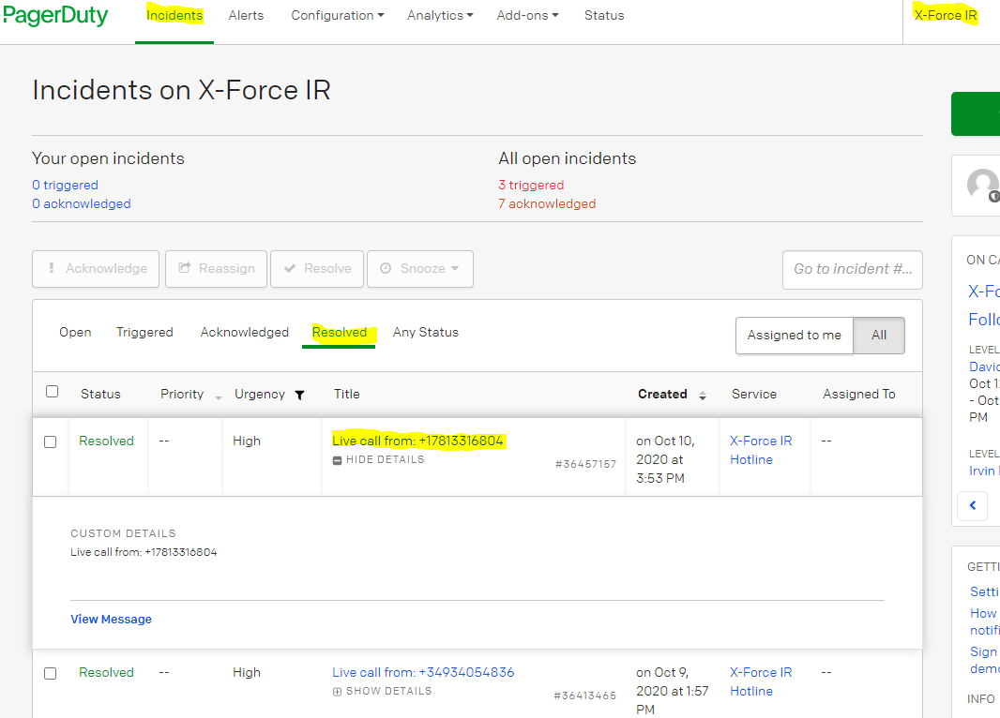
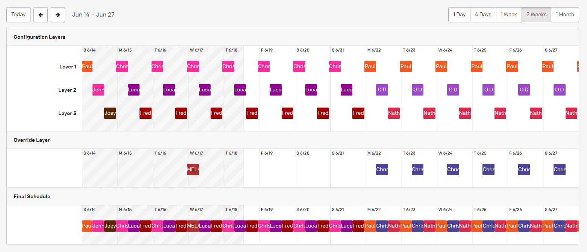
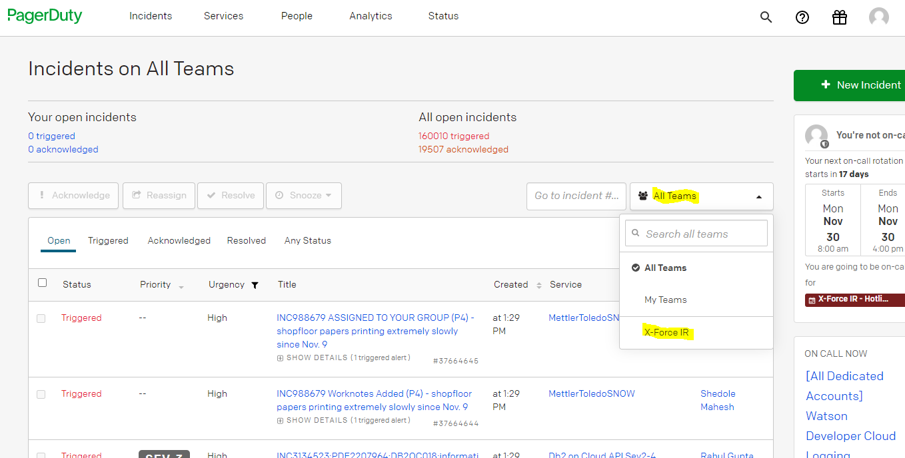
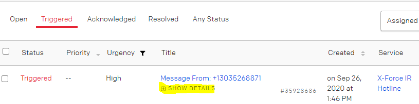
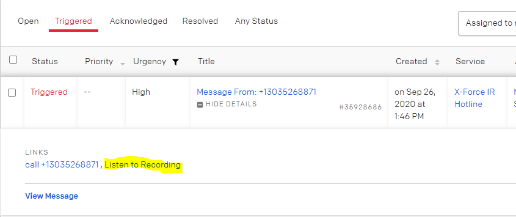
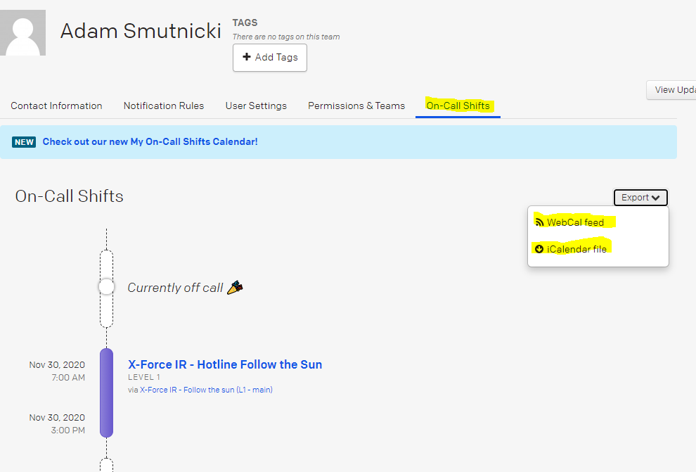
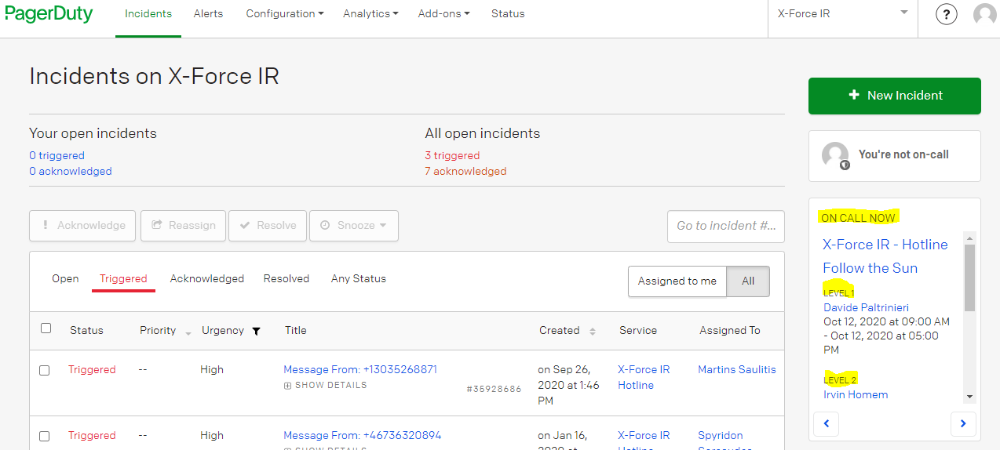

## Table of Contents
 1. [**Introduction**](#Introduction)
 2. [**How Does it Work**](#How-does-it-work)
	- [Integration of Legacy Hotline Systems](#Integration-of-Legacy-Hotline-Systems)
	- [What Happens When a Call Reaches PagerDuty?](#What-Happens-When-a-Call-Reaches-PagerDuty)
	- [Tracking Hotline Calls](#Tracking-Hotline-Calls)
	- [Scheduling](#Scheduling)
 3. [**Newcomer On-boarding**](#Newcomer-on-boarding)
 4. [**Tutorials**](#tutorials)
	 - [Setting-up Your Environment for the First Time](#Setting-up-your-environment-for-the-first-time)
	 - [Handling Voice Messages](#Handling-Voice-Messages)
	 - [Using Calendar Feeds to Track On-call Schedule](#Using-Calendar-Feeds-to-Track-On-Call-Schedule)
	 - [Checking Who Is Currently On-call](#Checking-Who-Is-Currently-On-call)

## Introduction
XFIR Hotline shifts are maintained by three main regions: APAC, EMEA and North America. Japan operates and maintains Hotline infrastructure independently, therefore all topics discussed on this page are not applicable to Japan. PagerDuty (PD), introduced into XFIR operations in 2018, is an application that facilitates the management of on-call rotations for those three main geographies.

PagerDuty administrators for XFIR teams are:

| Region | PagerDuty Admin | Alternate |
|--|--|--|
| Asia-Pacific (APAC) | Amanda Nelson (anelson@au1.ibm.com) | Chris Tappin (chris.tappin@ibm.com) |
| Europe, Middle East, & Africa (EMEA) | Adam Smutnicki (adam.smutnicki@pl.ibm.com) | Eben Louw (eben.louw@ibm.com)|
| North America (NA)| Fred Chidsey (fachidse@us.ibm.com) | Phil Harrold (rpharrol@us.ibm.com) |

PagerDuty for IBM was deployed as company-wide tool and for this reason is shared among multiple teams. There is no sufficient separation between teams and granular enough access control, so no sensitive information can be entered there. Be responsible - make sure you do not interact with the configuration or data belonging to other teams within IBM.

Additional important information:
* PagerDuty IBM instance link: [https://ibm.pagerduty.com/incidents](https://ibm.pagerduty.com/incidents) - log in using your IBM w3 Single Sign On credentials.
* Support:
	* inside IBM: pagerduty@us.ibm.com
	* External: https://w3.ibm.com/w3publisher/pagerduty/support
* Initial setup was built by Adam Smutnicki (adam.smutnicki@pl.ibm.com) from XFIR EMEA - if you have any questions reach out to him. 
* There is an official PD mobile app (available for iOS and Android). It is recommended to install the app to help with handling Hotline calls when you're away from your computer.

 The following documentation is a living document. If there is something you want to see documented here or explained with further detail please contact your geography Functional IR Lead (listed on the [Homepage](Home)).

## How Does it Work?
### Integration of Legacy Hotline Systems
Practically all hotline numbers are provided by different providers:
- APAC - Telstra
- EMEA - British Telecom (BT)
- NA and world wide number - RACC

Note: Country-specific hotline numbers are managed by each region and listed on the [Wiki page covering hotline operations](Global-IR-Hotline)

It was not possible to transfer Hotline numbers between operators, so to integrate them under one of the providers, we would need to change several hotline numbers. XFIR decided that this was not an acceptable solution and decided to use PD as a central point for integration. All hotline numbers from RACC, Telstra and BT are pointing to a single phone number offered by PD. This way every incoming Hotline call is redirected to PD, which forwards it to the mobile/cell phone of the person who is currently on-call. 

XFIR PD hotline number is +44 808 178 1527. One can simply call this number and reach out directly to the PD system. XFIR has not advertised this number as an official XFIR Hotline number and uses it only for integration.

### What Happens When a Call Reaches PagerDuty?
At first PD plays a configurable welcome message to the caller. The intention of this welcome message is to inform callers that they have reached IBM XFIR in the hope that wrong numbers will hang up before reaching hotline staff. In the past we used to receive a lot of wrong number calls, but the welcome message has reduced these. 

The currently configured welcome message is: "*Welcome. This is the IBM X-Force Incident Response Hotline where you can declare an emergency security incident and request assistance. If your call cannot be connected to an on-call consultant within 3 minutes you will be presented with the option to leave a voice message. Please leave a message detailing your name, a contact number and the organisation from which you are calling and you will be called back urgently.*". Afterwards, PD automatically adds: "*Attempting to connect you to an on-call responder*".

The on-call person will then receive a call marked with a Hotline caller number (with an exception explained in the [Tracking Hotline Calls](#Tracking-Hotline-Calls)). Upon picking up the call, a computerized voice states "*Incoming PagerDuty call. Press 1 to connect.*".

Pressing "1" on your phone's keypad establishes a connection with the person calling the Hotline and will mark this connection as "Acknowledged". If a call is not acknowledged, then it will go along the escalation path to second person on-call according to the L2 schedule and so on.

Who is on-call at any given moment in time is defined in PD by a "Schedule". The flow of notifications and actions when a call reaches the hotline is known as an "Escalation Path". The current escalation path for the XFIR hotline (as described in the [Hotline Operations](Global-IR-Hotline#Hotline-Operations)) is:
1) **Primary on-call person** determined by "[X-Force IR - Follow the sun (L1 - main)](https://ibm.pagerduty.com/schedules#PAL8VJX)" schedule (often referenced by team members as L1). If the designated person is not available or does not pick up a call within 30 seconds, the call is escalated to: 
2) **Secondary on-call person** determined by "[X-Force IR - Follow the sun (L2 - overflow)](https://ibm.pagerduty.com/schedules#PB084QZ)" schedule (often referenced by team members as L2). If this person is not available or does not pick up a call for 30 seconds, the call is escalated to:
3) **Geography Lead** determine by "X-Force IR - Follow the sun (L3 - Leads)" schedule. If this person is not available or does not pick up a call for 30 seconds, the call is escalated to:
4) **Voicemail message service**, which then triggers widespread notifications in the event that the caller leaves a message. Please see section [Handling Voice Messages](#Handling-Voice-Messages) for details on what happens when a Voice Message is left by a person calling the Hotline.

When voicemail is left, PD will use escalation path, attempting to notify current on-call team about unhandled call, by calling their mobile number, sending mobile app notifications, emails and text messages. This operations will be performed in a loop, with 3 minutes timeout period between moving to next person from escalation path. Together, this should cause PD to chase three on-call people for a period of up to 86 minutes. 

If the Primary on-call person's line is busy, PD may keep attempting to call this number for the 30 second period they have to acknowledge the call, and in some locations the on-call person may be notified that a hotline call is pending if their mobile phone provider offers the 'call waiting' feature.

In the past the XFIR team performed a stress test of the PD, generating a significant volume of calls, and exceeding several times the highest rate of calls ever observed. It was confirmed that PD can redirect all of them and that in such situation it is the on-call people and their mobile phones who become a "bottleneck" rather than the PD service.

The option to leave a voicemail within Pager Duty is the best solution to address peak call volumes, allowing the on-call team to work through them within PD. 

### Tracking Hotline Calls
Every call is recorded as an "Incident" in PD, which is marked as Acknowledged when the on-call person answers it and marked as resolved when the call ends. Incident is also created in case a voicemail is left, with an exception that status is marked as "Triggered", until it has been acknowledged by anyone. Every PD incident contains a source phone number of a caller, which can be checked in the incident (if you picked up a call, then look within resolved incidents):

For Hotline numbers managed by the NA team (NA and worldwide numbers), source phone number will not represent the caller number (most probably will be +18475722285). This is due to the configuration of RACC. For this reason, one should not rely entirely on the source phone numbers recorded in PD.

There is one specific case in which PagerDuty will not create an Incident ticket for an incoming call: when on-call assigned people do not answer the call, and the caller does not leave a Voicemail. In such a case there is no option to use Incident information to track a Hotline call, and the only source of information is a missed call on the mobile phone of the on-call person (unless it was not a call to a NA or worldwide hotline number as explained above).

PD has many functions supporting handling and escalating incidents, however due to the sensitivity of data processed by XFIR, as well as dedicated Resilient instance, PD is used only to handle Hotline calls. 

### Scheduling
The on-call person is determined using PD Schedules - separate for Primary and Secondary persons. Each Schedule consists of three "layers", one per shift. See below picture for reference.

Which layer an on-call person is part of depends on their geographical location:
* Layer 1 represents APAC and is limited to timeframe 23:00-07:00 UTC
* Layer 2 represents EMEA and is limited to timeframe 07:00-15:00 UTC
* Layer 3 represents NA and is limited to timeframe 15:00-23:00 UTC.

Do not confuse layers within a schedule with terms L1/L2 used to name main and backup schedules.

All 3 layers are concatenated into continuous "Final schedule" displayed on the bottom row of the picture. PD is using a "Final Schedule" layer from each schedule to automatically determine the current on-call person. Transition between people within a Schedule is performed automatically by PD and does not require any action.

Each Layer has a pool of people allocated automatically using a Round Robin algorithm. This means, that people are not able to pick a week which suits them, rather they are automatically assigned. This approach removes manual housekeeping work, which was getting complicated as the teams were growing. By design, schedules are not directly modifiable (i.e. by changing order of people) except permanently adding or removing a member from a rotation pool. 

If a person gets allocated to a shift which may collide with future business (eg. customer travel) or private (eg. holiday, family obligations, etc) plans, cover for all or part of that shift is needed. To implement this PD uses a "Schedule override" to replace an on-call person within a schedule with another person.

Such override can be set up in advance, for any time period. An example of such a situation is visible in the above screenshot - person from Layer 1 is replaced on 17th June by entry in the "Override Layer". We can see that "Final schedule" contains the person from "Override layer" instead of the person configured in "Layer 1". A common approach among team members is to swap whole weeks when there is a bigger collision. Alternatively, if the primary on-call person is not available for a short period of time, e.g. once, just for few hours, a short override should be used. 

Due to fact that there is a single configuration for the global XFIR team and insufficiently granular rights protecting this configuration, the number of people who can schedule an override has been limited to reduce the likelihood of human error. Currently, overrides can only be set up by anyone having a 'Manager' or 'Responder' role, with most members of the team holding the role 'Observer with additional permissions'.

To find someone to make changes on your behalf please see the PD XFIR Admins list in the [Introduction](#Introduction) section.

## Newcomer On-boarding
Every new team member who will be supporting the Hotline must configure their mobile phone and PagerDuty profile according to following steps:
1. Log into [PagerDuty](https://ibm.pagerduty.com/incidents) with IBM w3 Single Sign On credentials, so your account is created.
2. Update your PD profile:
	- Enter your IBM mobile number as "Phone number" - this is the number PD will be calling.
	- Enter your IBM mobile number as "SMS" and your IBM email address as "email" for escalation of missed hotline calls. 
	- Set your timezone. All timestamps in PD will be displayed according to this setting.
3. Disable personal voicemail on your IBM mobile number.
4. Work with your manager, regional IR Functional Lead or your regional Pager Duty admin to be added to an on-call schedules, which will include:
	- adding you to a Global XFIR team in PD
	- adding to the L1 schedule, L2 schedule, or both
5. Check when you're on-call for the first time.
6. Set up the mobile app on your IBM mobile phone.
7. Read [Tutorials](#tutorials) section below to get familiar with using PD.
8. Set up your PD environment according to below [Tutorials](#tutorials).
9. Reach out to your regional IR Functional Lead or your manager if you have any further questions.

**Disabling personal voicemail is critical for Hotline operations**, and everyone should double check that they have successfully disabled it. Not doing so can cause severe consequences for XFIR. If a customer leaves a message on a personal IBM voicemail it is not accessible by other team members, who may not know a customer is trying to contact us. PD voicemail is accessible by everyone on the team and gives the XFIR team the best chance of meeting our SLAs for responding to clients. 

## Tutorials

### Setting-up Your Environment for the First Time
1. Navigate to [https://ibm.pagerduty.com/](https://ibm.pagerduty.com/) and sign in with your IBM w3ID credentials.
2. On the right of the screen there is a *Team selection* option, visible as "All Teams". Unfold it and change your team to XFIR. Please keep in mind that there is no separation of IBM teams within PD, which means that everyone sees everything. Change your team to ensure that all your views contain only items related to our team.

### Handling PD Voicemail
Voicemails can be left by a person calling the Hotline who failed to reach both the L1, L2 and L3 persons. From a PagerDuty perspective, this incident is not assigned to anyone and it will begin alerting people from the Escalation Path to ensure that someone picks it up. This means that you can receive phone calls, text messages and emails from PD, until someone acknowledges the incident (representing a hotline call) and assigns it to themselves.

The voicemail message can be listened from a PagerDuty mobile application (both for Android and iOS) or PagerDuty web page.

Using Web GUI:
1. Navigate to Incidents.
2. Under "Open Incidents" section find a relevant hotline connection.
3. Unfold "SHOW DETAILS" without entering into this ticket.

4. Click on "Listen to Recording".

**It is very important to update PD Incidents having voicemails as resolved**. They are not automatically marked as resolved, as opposed to incidents created by hotline calls which are picked up by the on-call person. 

### Using Calendar Feeds to Track On-call Schedule
Entering "My Profile" settings, it it possible to get WebCal feed or iCalendar file with an up-to-date schedule of a personal on-call schedule.

All schedules (L1 and L2) are combined in this feed, so all necessary information is provided in a single place.

### Checking Who Is Currently On-call
Click PagerDuty in the top left corner or navigate to "Incidents". The pane on the right side will contain information showing who is currently on-call.

